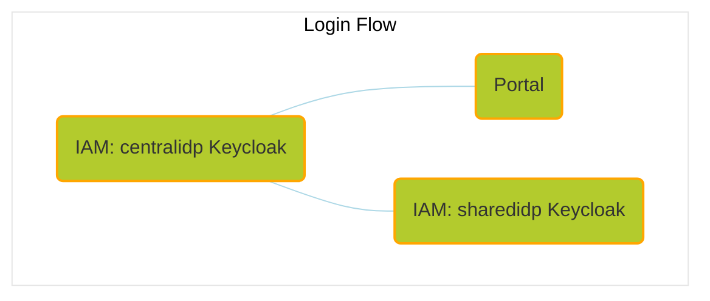

[](https://github.com/eclipse-tractusx/tractus-x-release/blob/24.05/CHANGELOG.md#2405---2024-05-29)

- [Umbrella Chart](#umbrella-chart)
  - [Note for R24.05](#note-for-r2405)
  - [Usage](#usage)
    - [Cluster setup](#cluster-setup)
      - [Linux \& Mac](#cluster-setup-on-linux--mac)
      - [Windows](#cluster-setup-on-windows)
    - [Network setup](#network-setup)
      - [Linux](#network-setup-on-linux)
      - [Mac](#network-setup-on-mac)
      - [Windows](#network-setup-on-windows)
      - [Hosts](#hosts)
    - [Install](#install)
      - [Use released chart](#use-released-chart)
        - [Install selected components](#option-1)
        - [Install predefined subsets of components](#option-2)
      - [Use local repository](#use-local-repository)
        - [Install selected components](#option-1-1)
        - [Install predefined subsets of components](#option-2-1)
    - [E2E Adopter Journeys](#e2e-adopter-journeys)
      - [Data exchange](#data-exchange)
      - [Get to know the Portal](#get-to-know-the-portal)
        - [Note for onboarding process](#note-for-onboarding-process)
    - [Uninstall](#uninstall)
    - [Ingresses](#ingresses)
    - [Database Access](#database-access)
    - [Keycloak Admin Console](#keycloak-admin-console)
    - [Seeding](#seeding)
    - [Self-signed TLS setup (Optional)](#self-signed-tls-setup-optional)
  - [Precondition for Semantic Hub](#precondition-for-semantic-hub)
  - [Precondition for IATP Mock](#precondition-for-iatp-mock)
  - [How to contribute](#how-to-contribute)

# Umbrella Chart

This umbrella chart provides a basis for running end-to-end tests or creating a sandbox environment of the [Catena-X](https://catena-x.net/en/) automotive dataspace network consisting of [Eclipse Tractus-X](https://projects.eclipse.org/projects/automotive.tractusx) OSS components.

The Chart aims for a completely automated setup of a fully functional network, that does not require manual setup steps.

## Note for R24.05

The versions of integrated components correspond to the **overarching [Release 24.05](https://github.com/eclipse-tractusx/tractus-x-release/blob/24.05/CHANGELOG.md#2405---2024-05-29)**.

:warning: The 24.05 Release does not include a Managed Identity Wallet (MIW) - aka the FOSS Wallet of Eclipse Tractus-X - as it was not - yet - able to cover functionalities required for the Self-Sovereign Identity Flow introduced with R24.05. To test and ship R24.05, a commercial solution was used: the Decentralized Identity Management (DIM) Wallet. To cover the wallet functionalities in the [E2E Adopter Journey Data exchange](#data-exchange) and [E2E Adopter Journey Portal](#portal), the [SSI DIM Wallet Stub](https://github.com/eclipse-tractusx/ssi-dim-wallet-stub) was added to the umbrella helm chart.

As an intermediate solution - before the SSI DIM Wallet Stub - the [iatp-mock](https://github.com/eclipse-tractusx/tractus-x-umbrella/tree/main/charts/umbrella/charts/iatpmock/Chart.yaml) was added, please see [Precondition for IATP Mock](#precondition-for-iatp-mock) if you'd still like to use it. Please be aware that it doesn't cover the wallet functionalities needed for the [E2E Adopter Journey Portal](#portal) for instance during the onboarding process of a company.

## Usage

Running this helm chart **requires** a kubernetes cluster (`>1.24.x`), it's recommended to run it on [**Minikube**](https://minikube.sigs.k8s.io/docs/start/).
Assuming you have a running cluster and your `kubectl` context is set to that cluster, you can use the following instructions to install the chart as `umbrella` release.

> **Note**
>
> In its current state of development, this chart as well as the following installation guide have been tested on Linux and Mac.
>
> **Linux** is the **preferred platform** to install this chart on, as the network setup with Minikube is very straightforward on Linux.
>
> We are working on testing the chart's reliability on Windows as well and updating the installation guide accordingly.

### Cluster setup

> Recommendations for resources
> | CPU(cores) | Memory(GB) |
> | :--------: | :--------: |
> |     4      |      6     |

> Use the dashboard provided by Minikube or a tool like OpenLens to get an overview about the deployed components:
>
> ```bash
> minikube dashboard
> ```

#### Cluster setup on Linux & Mac

```bash
minikube start --cpus=4 --memory 6gb
```

#### Cluster setup on Windows

For DNS resolution to work you need to either use `--driver=hyperv` option which requires administrator privileges:

```bash
minikube start --cpus=4 --memory 6gb --driver=hyperv
```

or use the native Kubernetes Cluster in *Docker Desktop* as well with a manual ingress setup:

```bash
# 1. Enable Kubernetes unter Settings > Kubernetes > Enable Kubernetes
# 2. Install an NGINX Ingress Controller
helm upgrade --install ingress-nginx ingress-nginx --repo https://kubernetes.github.io/ingress-nginx --namespace ingress-nginx --create-namespace
# 3. Skip the minikube addons and assume 127.0.0.1 for Cluster IP 
```

> :warning: The rest of the tutorial assumes a minikube cluster, however.

### Network setup

In order to enable the local access via **ingress**, use the according addon for Minikube:

```bash
minikube addons enable ingress
```

Make sure that the **DNS** resolution for the hosts is in place:

```bash
minikube addons enable ingress-dns
```

And execute installation step [3 Add the `minikube ip` as a DNS server](https://minikube.sigs.k8s.io/docs/handbook/addons/ingress-dns) for your OS:

#### Network setup on Linux

On Linux, you should identify your domain name resolver configuration, and update its configuration accordingly. To that end, look at the first lines of `/etc/resolv.conf`:

- if it mentions `resolvconf`, resolution is likely handled by **resolvconf**,
- if it is `# Generated by NetworkManager`, resolution is handled by **NetworkManager**,
- if it similar to `# This is /run/systemd/resolve/stub-resolv.conf managed by man:systemd-resolved(8)`, resolution is handled by **systemd-resolved**.

Start minikube, and apply the configuration below matching your system configuration.

##### Linux OS with resolvconf

Update the file `/etc/resolvconf/resolv.conf.d/base` to have the following contents.

```
search test
nameserver 192.168.99.169
timeout 5
```

Replace `192.168.99.169 with` the output of `minikube ip`.

If your Linux OS uses `systemctl`, run the following commands.

```shell
sudo resolvconf -u
systemctl disable --now resolvconf.service
```

See https://linux.die.net/man/5/resolver

##### Linux OS with NetworkManager

NetworkManager can run integrated caching DNS server - `dnsmasq` plugin and can be configured to use separate nameservers per domain.

Edit `/etc/NetworkManager/NetworkManager.conf` and enable `dns=dnsmasq` by adding:

```
[main]
dns=dnsmasq
```

Also see `dns=` in [NetworkManager.conf](https://developer.gnome.org/NetworkManager/stable/NetworkManager.conf.html).

Configure dnsmasq to handle domain names ending with `.test`:

```shell
sudo mkdir -p /etc/NetworkManager/dnsmasq.d/
echo "server=/test/$(minikube ip)" | sudo tee /etc/NetworkManager/dnsmasq.d/minikube.conf
```

Restart Network Manager:

```shell
systemctl restart NetworkManager.service
```

Ensure your `/etc/resolv.conf` contains only single nameserver:

```shell
cat /etc/resolv.conf | grep nameserver
nameserver 127.0.0.1
```

##### Linux OS with systemd-resolved

Run the following commands to add the minikube DNS for `.test` domains:

```shell
sudo mkdir -p /etc/systemd/resolved.conf.d
sudo tee /etc/systemd/resolved.conf.d/minikube.conf << EOF
[Resolve]
DNS=$(minikube ip)
Domains=~test
EOF
sudo systemctl restart systemd-resolved
```

If you still face DNS issues, add [the hosts](#hosts) to your `/etc/hosts` file.

#### Network setup on Mac

Create a file in /etc/resolver/minikube-test with the following contents.

```
domain tx.test
nameserver 192.168.49.2
search_order 1
timeout 5
```

Replace `192.168.49.2` with your `minikube ip` if it differs.

To find out the IP address of your Minikube execute:

```bash
minikube ip
```

If you still face DNS issues, add [the hosts](#hosts) to your `/etc/hosts` file.

**Additional network setup for Mac**

Install and start [Docker Mac Net Connect](https://github.com/chipmk/docker-mac-net-connect#installation).

We also recommend to execute the usage example after install to check proper setup.

#### Network setup on Windows

Open `Powershell` as Administrator and execute the following.

```shell
Add-DnsClientNrptRule -Namespace ".test" -NameServers "$(minikube ip)"
```

The following will remove any matching rules before creating a new one. This is useful for updating the minikube ip.

```shell
Get-DnsClientNrptRule | Where-Object {$_.Namespace -eq '.test'} | Remove-DnsClientNrptRule -Force; Add-DnsClientNrptRule -Namespace ".test" -NameServers "$(minikube ip)"
```

If you still face DNS issues, add [the hosts](#hosts) to your `C:\Windows\System32\drivers\etc\hosts` file.

#### Hosts

Collection of hosts to be added to the `/etc/hosts` (Linux and Mac) or the `C:\Windows\System32\drivers\etc\hosts` (Windows) file, in case [Network setup#Linux](#network-setup-on-linux), [Network setup#Mac](#network-setup-on-mac) or [Network setup#Windows](#network-setup-on-windows) doesn't work:

```
192.168.49.2    centralidp.tx.test
192.168.49.2    sharedidp.tx.test
192.168.49.2    portal.tx.test
192.168.49.2    portal-backend.tx.test
192.168.49.2    semantics.tx.test
192.168.49.2    sdfactory.tx.test
192.168.49.2    ssi-credential-issuer.tx.test
192.168.49.2    dataconsumer-1-dataplane.tx.test
192.168.49.2    dataconsumer-1-controlplane.tx.test
192.168.49.2    dataprovider-dataplane.tx.test
192.168.49.2    dataprovider-controlplane.tx.test
192.168.49.2    dataconsumer-2-dataplane.tx.test
192.168.49.2    dataconsumer-2-controlplane.tx.test
192.168.49.2    bdrs-server.tx.test
192.168.49.2    iatpmock.tx.test
192.168.49.2    business-partners.tx.test
192.168.49.2    pgadmin4.tx.test
192.168.49.2    ssi-dim-wallet-stub.tx.test
```

Replace `192.168.49.2` with your `minikube ip` if it differs.

To find out the IP address of your Minikube execute:

```bash
minikube ip
```

### Install

Select a subset of components which are designed to integrate with each other for a certain functional use case and enable those at install.

The currently available components are following:

- [portal](https://github.com/eclipse-tractusx/portal/tree/portal-2.0.0)
- [centralidp](https://github.com/eclipse-tractusx/portal-iam/tree/v4.0.0-alpha.2)
- [sharedidp](https://github.com/eclipse-tractusx/portal-iam/tree/v4.0.0-alpha.1)
- [bpndiscovery](https://github.com/eclipse-tractusx/sldt-bpn-discovery/tree/bpndiscovery-0.2.2)
- [discoveryfinder](https://github.com/eclipse-tractusx/sldt-discovery-finder/tree/discoveryfinder-0.2.2)
- [sdfactory](https://github.com/eclipse-tractusx/sd-factory/tree/sdfactory-2.1.12)
- [managed-identity-wallet](https://github.com/eclipse-tractusx/managed-identity-wallet/tree/v0.4.0)
- [semantic-hub](https://github.com/eclipse-tractusx/sldt-semantic-hub/tree/semantic-hub-0.2.2)
- [ssi credential issuer](https://github.com/eclipse-tractusx/ssi-credential-issuer/tree/v1.0.0)
- [dataconsumerOne](https://github.com/eclipse-tractusx/tractus-x-umbrella/tree/main/charts/tx-data-provider) ([tractusx-edc](https://github.com/eclipse-tractusx/tractusx-edc/tree/0.7.1), [vault](https://github.com/hashicorp/vault-helm/tree/v0.20.0))
- [tx-data-provider](https://github.com/eclipse-tractusx/tractus-x-umbrella/tree/main/charts/tx-data-provider) ([tractusx-edc](https://github.com/eclipse-tractusx/tractusx-edc/tree/0.7.1), [digital-twin-registry](https://github.com/eclipse-tractusx/sldt-digital-twin-registry/tree/digital-twin-registry-0.4.5), [vault](https://github.com/hashicorp/vault-helm/tree/v0.20.0), [simple-data-backend](https://github.com/eclipse-tractusx/tractus-x-umbrella/tree/main/charts/simple-data-backend))
- [dataconsumerTwo](https://github.com/eclipse-tractusx/tractus-x-umbrella/tree/main/charts/tx-data-provider) ([tractusx-edc](https://github.com/eclipse-tractusx/tractusx-edc/tree/0.7.1), [vault](https://github.com/hashicorp/vault-helm/tree/v0.20.0))
- [bdrs](https://github.com/eclipse-tractusx/bpn-did-resolution-service/tree/0.0.4) (**in memory** - no persistance possible)
- [iatp-mock](https://github.com/eclipse-tractusx/tractus-x-umbrella/tree/main/charts/umbrella/charts/iatpmock/Chart.yaml)
- [bpdm](https://github.com/eclipse-tractusx/bpdm/tree/release/6.0.x)
- [ssi-dim-wallet-stub](https://github.com/eclipse-tractusx/ssi-dim-wallet-stub/releases/tag/ssi-dim-wallet-stub-0.1.2)

> :warning: **Note**
>
> Please be aware of [Note for R24.05](#note-for-r2405)
>
> - Due to resource restrictions, it's **not recommended** to install the helm chart with all components enabled.
>
> - It is to be expected that some pods - which run as post-install hooks, like for instance the **portal-migrations job - will run into errors until another component**, like for instance a database, is ready to take connections.
> Those jobs will recreate pods until one run is successful.
>
> - **Persistance is disabled by default** but can be configured in a custom values file.

#### Use released chart

```bash
helm repo add tractusx-dev https://eclipse-tractusx.github.io/charts/dev
```

**:grey_question: Command explanation**

> `helm install` is used to install a chart in Kubernetes using Helm.
> > `--set COMPONENT_1.enabled=true,COMPONENT_2.enabled=true` Enables the components by setting their respective enabled values to true.
> 
> > `umbrella` is the release name for the chart.
> 
> > `tractusx-dev/umbrella` specifies the chart to install, with *tractusx-dev* being the repository name and *umbrella* being the chart
name.
> 
> > `--namespace umbrella` specifies the namespace in which to install the chart.
>
> > `--create-namespace` create a namespace with the name `umbrella`.

##### Option 1

Install with your chosen components enabled:

```bash
helm install \
  --set COMPONENT_1.enabled=true,COMPONENT_2.enabled=true,COMPONENT_3.enabled=true \
  umbrella tractusx-dev/umbrella \
  --namespace umbrella \
  --create-namespace
```

##### Option 2

Choose to install one of the predefined subsets (currently in focus of the **E2E Adopter Journey**):

**Data Exchange Subset**

```bash
helm install \
  --set centralidp.enabled=true,managed-identity-wallet.enabled=true,dataconsumerOne.enabled=true,tx-data-provider.enabled=true \
  umbrella tractusx-dev/umbrella \
  --namespace umbrella \
  --create-namespace
```

*Optional*

Enable `dataconsumerTwo` at upgrade:

```bash
helm install \
  --set centralidp.enabled=true,managed-identity-wallet.enabled=true,dataconsumerOne.enabled=true,tx-data-provider.enabled=true,dataconsumerTwo.enabled=true \
  umbrella tractusx-dev/umbrella \
  --namespace umbrella
```

**Portal Subset**

```bash
helm install \
  --set portal.enabled=true,centralidp.enabled=true,sharedidp.enabled=true \
  umbrella tractusx-dev/umbrella \
  --namespace umbrella \
  --create-namespace
```

**BPDM Subset**
```bash
helm install \
  --set bpdm.enabled=true,centralidp.enabled=true \
  umbrella tractusx-dev/umbrella \
  --namespace umbrella \
  --create-namespace
```

To set your own configuration and secret values, install the helm chart with your own values file:

```bash
helm install -f your-values.yaml umbrella tractusx-dev/umbrella --namespace umbrella --create-namespace
```

#### Use local repository

Make sure to clone the [tractus-x-umbrella](https://github.com/eclipse-tractusx/tractus-x-umbrella) repository beforehand.

Then navigate to the chart directory:

```bash
cd charts/umbrella/
```

Download the dependencies of the tx-data-provder subchart:

```bash
helm dependency update ../tx-data-provider
```

Download the chart dependencies of the umbrella helm chart:

```bash
helm dependency update
```

**:grey_question: Command explanation**

> `helm install` is used to install a Helm chart.
> > `-f your-values.yaml` | `-f values-*.yaml` specifies the values file to use for configuration.
>
> > `umbrella` is the release name for the Helm chart.
>
> > `.` specifies the path to the chart directory.
>
> > `--namespace umbrella` specifies the namespace in which to install the chart.
>
> > `--create-namespace` create a namespace with the name `umbrella`.

##### Option 1

Install your chosen components by having them enabled in a `your-values.yaml` file:

```bash
helm install -f your-values.yaml umbrella . --namespace umbrella --create-namespace
```

> In general, all your specific configuration and secret values should be set by installing with an own values file.

##### Option 2

Choose to install one of the predefined subsets (currently in focus of the **E2E Adopter Journey**):

**Data Exchange Subset**

```bash
helm install -f values-adopter-data-exchange.yaml umbrella . --namespace umbrella --create-namespace
```

*Optional*

Enable `dataconsumerTwo` by setting it true in `values-adopter-data-exchange.yaml` and then executing an upgrade:

```bash
dataconsumerTwo:
  enabled: true
```

```bash
helm upgrade -f values-adopter-data-exchange.yaml umbrella . --namespace umbrella
```

*iatp-mock Version*

```bash
helm install -f values-adopter-data-exchange-iatp-mock.yaml umbrella . --namespace umbrella --create-namespace
```

**Portal Subset**

```bash
helm install -f values-adopter-portal.yaml umbrella . --namespace umbrella --create-namespace
```

### E2E Adopter Journeys

#### Data exchange

Involved components:

CentralIdP, DBRS-Server-Memory, Data Consumer, Data Provider, SSI Credential Issuer, SSI Dim Wallet Stub.

To start the Data Exchange, it is necessary to execute the [involved components](https://github.com/eclipse-tractusx/tractus-x-umbrella/blob/umbrella-2.0.0/charts/umbrella/README.md#option-2-1)

There are two ways to test and execute the Data Exchange tutorial:

**1. Postman**

You can import the Umbrella [Postman Collection](../../docs/api/postman/UmbrellaConnectorData-Exchange.postman_collection.json)

**2. Curl**

You can follow the [Curl Steps](../../docs/api/curl/UmbrellaConectorDataExchange.md)

#### Get to know the Portal

Perform first login and send out an invitation to a company to join the network (SMTP account required to be configured in custom values.yaml file).

Proceed with the login to the <http://portal.tx.test> to verify that everything is setup as expected.

Credentials to log into the initial example realm (CX-Operator):

```
cx-operator@tx.test
```

```
tractusx-umbr3lla!
```



The relevant hosts are the following:

- <http://centralidp.tx.test/auth/>
- <http://sharedidp.tx.test/auth/>
- <http://portal-backend.tx.test>
- <http://portal.tx.test>

In case that you have TLS enabled (see [Self-signed TLS setup (Optional)](#self-signed-tls-setup-optional)), make sure to accept the risk of the self-signed certificates for all the hosts before performing the first login:

- <https://centralidp.tx.test/auth/>
- <https://sharedidp.tx.test/auth/>
- <https://portal-backend.tx.test>
- <https://portal.tx.test>

##### Note for onboarding process

 Since the onboarding process requires the [Clearinghouse](https://github.com/eclipse-tractusx/portal-assets/blob/v2.1.0/docs/developer/Technical%20Documentation/Interface%20Contracts/Clearinghouse.md) to work properly, but ClearingHouse currently isn't available as a FOSS application you can skip the step with the following SQL Script which must be executed against the portal database.

```sql
WITH applications AS (
    SELECT distinct ca.id as Id, ca.checklist_process_id as ChecklistId
    FROM portal.company_applications as ca
             JOIN portal.application_checklist as ac ON ca.id = ac.application_id
    WHERE 
      ca.application_status_id = 7 
    AND ac.application_checklist_entry_type_id = 6
    AND (ac.application_checklist_entry_status_id = 4 OR ac.application_checklist_entry_status_id = 1)
),
updated AS (
 UPDATE portal.application_checklist
     SET application_checklist_entry_status_id = 3
     WHERE application_id IN (SELECT Id FROM applications)
     RETURNING *
)
INSERT INTO portal.process_steps (id, process_step_type_id, process_step_status_id, date_created, date_last_changed, process_id, message)
SELECT gen_random_uuid(), 12, 1, now(), NULL, a.ChecklistId, NULL
FROM applications a;
```

### Uninstall

To teardown your setup, run:

```shell
helm delete umbrella --namespace umbrella
```

> :warning:
>
> If persistance for one or more components is enabled, the persistent volume claims (PVCs) and connected persistent volumes (PVs) need to be removed manually even if you deleted the release from the cluster.
>

### Ingresses

Currently enabled ingresses:

- http://centralidp.tx.test/auth/
- http://sharedidp.tx.test/auth/
- http://portal-backend.tx.test
  - http://portal-backend.tx.test/api/administration/swagger/index.html
  - http://portal-backend.tx.test/api/registration/swagger/index.html
  - http://portal-backend.tx.test/api/apps/swagger/index.html
  - http://portal-backend.tx.test/api/services/swagger/index.html
  - http://portal-backend.tx.test/api/notification/swagger/index.html
- http://portal.tx.test
- http://semantics.tx.test/discoveryfinder/swagger-ui/index.html
- http://ssi-credential-issuer.tx.test/api/issuer/swagger/index.html
- http://dataconsumer-1-controlplane.tx.test
- http://dataconsumer-1-dataplane.tx.test
- http://dataprovider-dataplane.tx.test
- http://dataconsumer-2-controlplane.tx.test
- http://dataconsumer-2-dataplane.tx.test
- http://business-partners.tx.test/pool
- http://business-partners.tx.test/orchestrator
- http://bdrs-server.tx.test
- http://iatpmock.tx.test
- http://pgadmin4.tx.test
- http://ssi-dim-wallet-stub.tx.test

### Database Access

This chart also contains a pgadmin4 instance for easy access to the deployed Postgres databases which are only available from within the Kubernetes cluster.

pgadmin4 is by default enabled with in the predefined subsets for data exchange and portal.

Address: [pgadmin4.tx.test](http://pgadmin4.tx.test)

Credentials to login into pgadmin4:

```
pgadmin4@txtest.org
```

```
tractusxpgdamin4
```

**The database server connections need to be added manually to pgadmin4.**

Default username for all connections:

```
postgres
```

Default user for all connections:

```
5432
```

In the following some of the available connections:

- portal

Host:

```
umbrella-portal-backend-postgresql
```

Password:

```
dbpasswordportal
```

- centralidp

Host:

```
umbrella-centralidp-postgresql
```

Password:

```
dbpasswordcentralidp
```

- sharedidp

Host:

```
umbrella-sharedidp-postgresql
```

Password:

```
dbpasswordsharedidp
```

- miw

Host:

```
umbrella-miw-postgres
```

Password:

```
dbpasswordmiw
```

- dataprovider

Host:

```
umbrella-dataprovider-db
```

Password:

```
dbpasswordtxdataprovider
```

- dataconsumer-1

Host:

```
umbrella-dataconsumer-1-db
```

Password:

```
dbpassworddataconsumerone
```

- dataconsumer-2

Host:

```
umbrella-dataconsumer-2-db
```

Password:

```
dbpassworddataconsumertwo
```

- bpdm

Host:

```
umbrella-bpdm-postgres
```

Password:

```
dbpasswordbpdm
```

### Keycloak Admin Console

Access to admin consoles:

- http://centralidp.tx.test/auth/
- http://sharedidp.tx.test/auth/

Default username for centralidp and sharedidp:

```
admin
```

Password centralidp:

```
adminconsolepwcentralidp
```

Password sharedidp:

```
adminconsolepwsharedidp
```


### Seeding

See [Overall Seeding](../../concept/seeds-overall-data.md).

### Self-signed TLS setup (Optional)

Some of the components are prepared to be configured with TLS enabled (see "uncomment the following line for tls" comments in [values.yaml](./values.yaml)).

If you'd like to make use of that, make sure to to execute this step beforehand.

Install cert-manager chart in the same namespace where the umbrella chart will be located.

```bash
helm repo add jetstack https://charts.jetstack.io
helm repo update
```

```bash
helm install \
  cert-manager jetstack/cert-manager \
  --namespace umbrella \
  --create-namespace \
  --version v1.14.4 \
  --set installCRDs=true
```

Configure the self-signed certificate and issuer to be used by the ingress resources.

If you have the repository checked out you can run:

```bash
kubectl apply -f ./charts/umbrella/cluster-issuer.yaml
```

or otherwise you can run:

```bash
kubectl apply -f - <<EOF
apiVersion: cert-manager.io/v1
kind: ClusterIssuer
metadata:
  name: selfsigned-issuer
spec:
  selfSigned: {}
---
apiVersion: cert-manager.io/v1
kind: Certificate
metadata:
  name: my-selfsigned-ca
  namespace: umbrella
spec:
  isCA: true
  commonName: tx.test
  secretName: root-secret
  privateKey:
    algorithm: RSA
    size: 2048
  issuerRef:
    name: selfsigned-issuer
    kind: ClusterIssuer
    group: cert-manager.io
  subject:
    organizations:
      - CX
    countries:
      - DE
    provinces:
      - Some-State
---
apiVersion: cert-manager.io/v1
kind: ClusterIssuer
metadata:
  name: my-ca-issuer
spec:
  ca:
    secretName: root-secret
EOF
```

See [cert-manager self-signed](https://cert-manager.io/docs/configuration/selfsigned) for reference.

## Precondition for Semantic Hub

In case of enabling `semantic-hub` the fuseki docker image must be built.
Build fuseki docker image by following the below steps:
- Download [jena-fuseki-docker-4.7.0.zip](https://repo1.maven.org/maven2/org/apache/jena/jena-fuseki-docker/4.7.0/jena-fuseki-docker-4.7.0.zip)
- Unzip the jena-fuseki-docker-4.7.0.zip.
- Build the docker image by running the command - `docker build --build-arg JENA_VERSION=4.7.0 -t jena-fuseki-docker:4.7.0 --platform linux/amd64 .`

## Precondition for IATP Mock

In case of enabling `iatpmock` (e.g. by using [values-adopter-data-exchange.yaml](values-adopter-data-exchange.yaml)), the iatp-mock docker image must be built first:

`docker build iatp-mock/ -t tractusx/iatp-mock:testing --platform linux/amd64`

## How to contribute

Before contributing, make sure, you read and understand our [contributing guidelines](/CONTRIBUTING.md).
We appreciate every contribution, be it bug reports, feature requests, test automation or enhancements to the Chart(s),
but please keep the following in mind:

- Avoid company specific setup
- Avoid any tooling/infra components, that requires a subscription in any form
- Be vendor and cloud agnostic
