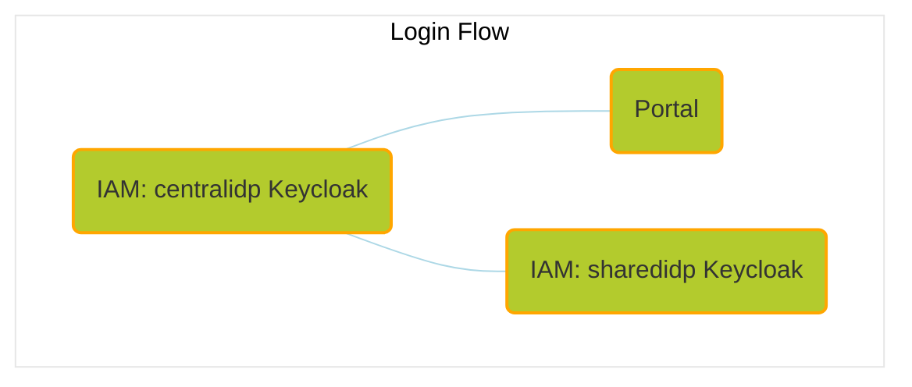

# Umbrella Chart

This umbrella chart provides a basis for running end-to-end tests or creating a sandbox environment of the [Catena-X](https://catena-x.net/en/) automotive dataspace network
consisting of [Tractus-X](https://projects.eclipse.org/projects/automotive.tractusx) OSS components.

The chart aims for a completely automated setup of a fully functional network, that does not require manual setup steps.

- [Usage](#usage)
- [Network setup](#network-setup)
- [Self-signed TLS setup](#self-signed-tls-setup)
- [Install](#install)
  - [Released chart](#released-chart)
  - [Repository](#repository)
  - [Custom configuration (E2E Adopter Journey)](#custom-configuration-e2e-adopter-journey)
- [E2E Adopter Journeys](#e2e-adopter-journeys)
  - [Get to know the portal](#get-to-know-the-portal)
  - [Data exchange](#data-exchange)
- [Uninstall](#uninstall)

## Usage

Running this helm chart **requires** a kubernetes cluster (`>1.24.x`), it's recommended to run it on [**Minikube**](https://minikube.sigs.k8s.io/docs/start/).
Assuming you have a running cluster and your `kubectl` context is set to that cluster, you can use the following instructions to install the chart as `umbrella` release.

> **Note**
>
> In its current state of development, this chart as well as the following installation guide have been tested on Linux and Mac.
>
> **Linux** is the **preferred platform** to install this chart on, as the network setup with Minikube is very straightforward on Linux.
>
> We plan to test the chart's reliability also on Windows and to update the installation guide accordingly.


> Recommendations for resources
> | CPU(cores) | Memory(GB) |
> | :--------: | :--------: |
> |     4      |      6     |


```bash
minikube start --cpus=4 --memory 6gb
```

> Use the dashboard provided by Minikube to get an overview about the deployed components:
>
> ```bash
> minikube dashboard

### Network setup

In order to enable the local access via **ingress**, use the according addon for Minikube:

```bash
minikube addons enable ingress
```

Make sure that the **DNS** resolution for the hosts is in place:

```bash
minikube addons enable ingress-dns
```
And execute installation step [3 Add the `minikube ip` as a DNS server](https://minikube.sigs.k8s.io/docs/handbook/addons/ingress-dns) for your OS:

Create a file in /etc/resolver/minikube-test with the following contents.

```
domain example.org
nameserver 192.168.49.2
search_order 1
timeout 5
```
Replace 192.168.49.2 with your minikube ip.

To find out the IP address of your Minikube:

```bash
minikube ip
```

If you still face DNS issues afterwards, add the hosts to your /etc/hosts file:

```
192.168.49.2    centralidp.example.org
192.168.49.2    sharedidp.example.org
192.168.49.2    portal.example.org
192.168.49.2    portal-backend.example.org
...
```

Replace 192.168.49.2 with your minikube ip.

**Additional network setup** (for Mac only)

Install and start [Docker Mac Net Connect](https://github.com/chipmk/docker-mac-net-connect#installation).

We also recommend to execute the usage example after install to check proper setup.

### Self-signed TLS setup

Install cert-manager chart in the same namespace where the umbrella chart will be located.

```bash
helm repo add jetstack https://charts.jetstack.io
helm repo update
```

```bash
helm install \
  cert-manager jetstack/cert-manager \
  --namespace umbrella \
  --create-namespace \
  --version v1.14.4 \
  --set installCRDs=true
```

Configure the self-signed certificate and issuer to be used by the ingress resources.

```bash
kubectl apply -f - <<EOF
apiVersion: cert-manager.io/v1
kind: ClusterIssuer
metadata:
  name: selfsigned-issuer
spec:
  selfSigned: {}
---
apiVersion: cert-manager.io/v1
kind: Certificate
metadata:
  name: my-selfsigned-ca
  namespace: umbrella
spec:
  isCA: true
  commonName: cx.local
  secretName: root-secret
  privateKey:
    algorithm: RSA
    size: 2048
  issuerRef:
    name: selfsigned-issuer
    kind: ClusterIssuer
    group: cert-manager.io
  subject:
    organizations:
      - CX
    countries:
      - DE
    provinces:
      - Some-State
---
apiVersion: cert-manager.io/v1
kind: ClusterIssuer
metadata:
  name: my-ca-issuer
spec:
  ca:
    secretName: root-secret
EOF
```

See [cert-manager self-signed](https://cert-manager.io/docs/configuration/selfsigned) for reference.

### Install

#### Released chart

```bash
helm repo add tractusx-dev https://eclipse-tractusx.github.io/charts/dev
```

```bash
helm install umbrella tractusx-dev/umbrella --namespace umbrella
```

#### Repository

Make sure to clone the [tractus-x-umbrella](https://github.com/eclipse-tractusx/tractus-x-umbrella) repository beforehand.

Then change to the chart directory:

```bash
cd charts/umbrella/
```

Download the chart dependencies:

```bash
helm dependency update
```

```bash
helm install umbrella . --namespace umbrella
```

#### Custom configuration (E2E Adopter Journey)

To set your own configuration and secret values, install the helm chart with your own values file:

```bash
helm install -f your-values.yaml umbrella tractusx-dev/umbrella --namespace umbrella
```

To install only the components currently in focus of the **E2E Adopter Journey**, install the helm chart with the values-adopter.yaml file:

```bash
helm install -f values-adopter.yaml umbrella tractusx-dev/umbrella --namespace umbrella
```

> **Note**
>
> It is to be expected that some pods - which run as post-install hooks, like for instance the portal-migrations job - will run into errors until other components, like for instance a database, is ready to take connections.
> Those jobs will recreate pods until one run is successful.
>

### E2E Adopter Journeys

#### Get to know the Portal

Perform first login and send out an invite to a company to join the network (SMTP account required to be configured in custom values.yaml file).

Make sure to accept the risk of the self-signed certificates for the following hosts using the continue option:
- [centralidp.example.org/auth/](https://centralidp.example.org/auth/)
- [sharedidp.example.org/auth/](https://sharedidp.example.org/auth/)
- [portal-backend.example.org](https://portal-backend.example.org)
- [portal.example.org](https://portal.example.org)

Then proceed with the login to the [portal](https://portal.example.org) to verify that everything is setup as expected.

Credentials to log into the initial example realm (CX-Operator):

```
cx-operator@example.org
```

```
tractusx-umbr3lla!
```



#### Data exchange

Involved components:

EDC, MIW, DTR, Vault (data provider and consumer in tx-data-provider), CentralIdP.

TBD.

### Uninstall

To teardown your setup, run:

```shell
helm delete umbrella --namespace umbrella
```
> **Note**
>
> Persistent Volume Claims (PVCs) and connected Persistent Volumes (PVs) need to be removed manually even if you deleted the release from the cluster.
>

## How to contribute

Before contributing, make sure, you read and understand our [contributing guidelines](/CONTRIBUTING.md).
We appreciate every contribution, be it bug reports, feature requests, test automation or enhancements to the Chart(s),
but please keep the following in mind:

- Avoid company specific setup
- Avoid any tooling/infra components, that requires a subscription in any form
- Be vendor and cloud agnostic
