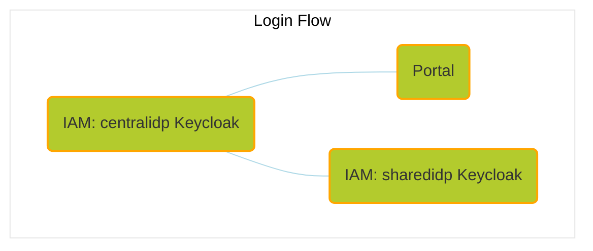

# Umbrella Chart

This umbrella chart provides a basis for running end-to-end tests or creating a sandbox environment of the [Catena-X](https://catena-x.net/en/) automotive dataspace network
consisting of [Tractus-X](https://projects.eclipse.org/projects/automotive.tractusx) OSS components.

The chart aims for a completely automated setup of a fully functional network, that does not require manual setup steps.

- [Usage](#usage)
- [Network setup](#network-setup)
- [Self-signed TLS setup](#self-signed-tls-setup)
- [Install](#install)
  - [Released chart](#released-chart)
  - [Repository](#repository)
- [E2E Adopter Journeys](#e2e-adopter-journeys)
  - [Data exchange](#data-exchange)
  - [Get to know the portal](#get-to-know-the-portal)
- [Uninstall](#uninstall)
- [Ingresses](#ingresses)
- [Seeding](#seeding)

## Usage

Running this helm chart **requires** a kubernetes cluster (`>1.24.x`), it's recommended to run it on [**Minikube**](https://minikube.sigs.k8s.io/docs/start/).
Assuming you have a running cluster and your `kubectl` context is set to that cluster, you can use the following instructions to install the chart as `umbrella` release.

> **Note**
>
> In its current state of development, this chart as well as the following installation guide have been tested on Linux and Mac.
>
> **Linux** is the **preferred platform** to install this chart on, as the network setup with Minikube is very straightforward on Linux.
>
> We plan to test the chart's reliability also on Windows and to update the installation guide accordingly.


> Recommendations for resources
> | CPU(cores) | Memory(GB) |
> | :--------: | :--------: |
> |     4      |      6     |


```bash
minikube start --cpus=4 --memory 6gb
```

> Use the dashboard provided by Minikube to get an overview about the deployed components:
>
> ```bash
> minikube dashboard

### Network setup

In order to enable the local access via **ingress**, use the according addon for Minikube:

```bash
minikube addons enable ingress
```

Make sure that the **DNS** resolution for the hosts is in place:

```bash
minikube addons enable ingress-dns
```
And execute installation step [3 Add the `minikube ip` as a DNS server](https://minikube.sigs.k8s.io/docs/handbook/addons/ingress-dns) for your OS:

Create a file in /etc/resolver/minikube-test with the following contents.

```
domain tx.test
nameserver 192.168.49.2
search_order 1
timeout 5
```
Replace 192.168.49.2 with your minikube ip.

To find out the IP address of your Minikube:

```bash
minikube ip
```

If you still face DNS issues afterwards, add the hosts to your /etc/hosts file:

```
192.168.49.2    centralidp.tx.test
192.168.49.2    sharedidp.tx.test
192.168.49.2    portal.tx.test
192.168.49.2    portal-backend.tx.test
192.168.49.2    managed-identity-wallets.tx.test
192.168.49.2    semantics.tx.test
```

Replace 192.168.49.2 with your minikube ip.

**Additional network setup** (for Mac only)

Install and start [Docker Mac Net Connect](https://github.com/chipmk/docker-mac-net-connect#installation).

We also recommend to execute the usage example after install to check proper setup.

### Self-signed TLS setup

Install cert-manager chart in the same namespace where the umbrella chart will be located.

```bash
helm repo add jetstack https://charts.jetstack.io
helm repo update
```

```bash
helm install \
  cert-manager jetstack/cert-manager \
  --namespace umbrella \
  --create-namespace \
  --version v1.14.4 \
  --set installCRDs=true
```

Configure the self-signed certificate and issuer to be used by the ingress resources.

```bash
kubectl apply -f - <<EOF
apiVersion: cert-manager.io/v1
kind: ClusterIssuer
metadata:
  name: selfsigned-issuer
spec:
  selfSigned: {}
---
apiVersion: cert-manager.io/v1
kind: Certificate
metadata:
  name: my-selfsigned-ca
  namespace: umbrella
spec:
  isCA: true
  commonName: tx.test
  secretName: root-secret
  privateKey:
    algorithm: RSA
    size: 2048
  issuerRef:
    name: selfsigned-issuer
    kind: ClusterIssuer
    group: cert-manager.io
  subject:
    organizations:
      - CX
    countries:
      - DE
    provinces:
      - Some-State
---
apiVersion: cert-manager.io/v1
kind: ClusterIssuer
metadata:
  name: my-ca-issuer
spec:
  ca:
    secretName: root-secret
EOF
```

See [cert-manager self-signed](https://cert-manager.io/docs/configuration/selfsigned) for reference.

### Install

Select a subset of components which are designed to integrate with each other for a certain functional use case and enable those at install.

The currently available components are following:

- [portal](https://github.com/eclipse-tractusx/portal/tree/portal-1.8.0)
- [centralidp](https://github.com/eclipse-tractusx/portal-iam/tree/v2.1.0)
- [sharedidp](https://github.com/eclipse-tractusx/portal-iam/tree/v2.1.0)
- [bpndiscovery](https://github.com/eclipse-tractusx/sldt-bpn-discovery/tree/bpndiscovery-0.2.2)
- [discoveryfinder](https://github.com/eclipse-tractusx/sldt-discovery-finder/tree/discoveryfinder-0.2.2)
- [sdfactory](https://github.com/eclipse-tractusx/sd-factory/tree/sdfactory-2.1.12)
- [managed-identity-wallet](https://github.com/eclipse-tractusx/managed-identity-wallet/tree/v0.4.0)
- [dataconsumer](https://github.com/eclipse-tractusx/tractus-x-umbrella/tree/main/charts/tx-data-provider) ([tractusx-edc](https://github.com/eclipse-tractusx/tractusx-edc/tree/0.5.3), [vault](https://github.com/hashicorp/vault-helm/tree/v0.20.0))
- [tx-data-provider](https://github.com/eclipse-tractusx/tractus-x-umbrella/tree/main/charts/tx-data-provider) ([tractusx-edc](https://github.com/eclipse-tractusx/tractusx-edc/tree/0.5.3), [digital-twin-registry](https://github.com/eclipse-tractusx/sldt-digital-twin-registry/tree/digital-twin-registry-0.4.5), [vault](https://github.com/hashicorp/vault-helm/tree/v0.20.0), [simple-data-backend](https://github.com/eclipse-tractusx/tractus-x-umbrella/tree/main/charts/simple-data-backend))

> :warning:
>
> Due to resource restrictions, it's not recommended to install the helm chart with all components enabled.
>

#### Released chart

```bash
helm repo add tractusx-dev https://eclipse-tractusx.github.io/charts/dev
```

Install with your chosen components enabled:

```bash
helm install \
  --set COMPONENT_1.enabled=true,COMPONENT_2.enabled=true,COMPONENT_3.enabled=true \
  umbrella tractusx-dev/umbrella \
  --namespace umbrella
```

Or choose to install one of the predefined subsets (currently in focus of the **E2E Adopter Journey**):

**Data Exchange**

```bash
helm install \
  --set centralidp.enabled=true,managed-identity-wallet.enabled=true,dataconsumer.enabled=true,tx-data-provider.enabled=true \
  umbrella tractusx-dev/umbrella \
  --namespace umbrella
```

**Portal**

```bash
helm install \
  --set portal.enabled=true,centralidp.enabled=true,sharedidp.enabled=true \
  umbrella tractusx-dev/umbrella \
  --namespace umbrella
```

To set your own configuration and secret values, install the helm chart with your own values file:

```bash
helm install -f your-values.yaml umbrella tractusx-dev/umbrella --namespace umbrella
```

#### Repository

Make sure to clone the [tractus-x-umbrella](https://github.com/eclipse-tractusx/tractus-x-umbrella) repository beforehand.

Then change to the chart directory:

```bash
cd charts/umbrella/
```

Download the chart dependencies:

```bash
helm dependency update
```

Install your chosen components by having them enabled in `your-values` file:

```bash
helm install -f your-values.yaml umbrella . --namespace umbrella
```

>
> In general, all your specific configuration and secret values can be set by installing with an own values file.
>

Or choose to install one of the predefined subsets (currently in focus of the **E2E Adopter Journey**):

**Data Exchange**

```bash
helm install -f values-adopter-data-exchange.yaml umbrella . --namespace umbrella
```

**Portal**

```bash
helm install -f values-adopter-portal.yaml umbrella . --namespace umbrella
```

> **Note**
>
> It is to be expected that some pods - which run as post-install hooks, like for instance the portal-migrations job - will run into errors until another component, like for instance a database, is ready to take connections.
> Those jobs will recreate pods until one run is successful.
>
> :warning:
>
> **Persistance is disabled by default** but can be configured in a custom values file.
>

### E2E Adopter Journeys

#### Data exchange

Involved components:

EDC, MIW, DTR, Vault (data provider and consumer in tx-data-provider), CentralIdP.

TBD.

#### Get to know the Portal

Perform first login and send out an invite to a company to join the network (SMTP account required to be configured in custom values.yaml file).

Make sure to accept the risk of the self-signed certificates for the following hosts using the continue option:
- [centralidp.tx.test/auth/](https://centralidp.tx.test/auth/)
- [sharedidp.tx.test/auth/](https://sharedidp.tx.test/auth/)
- [portal-backend.tx.test](https://portal-backend.tx.test)
- [portal.tx.test](https://portal.tx.test)

Then proceed with the login to the [portal](https://portal.tx.test) to verify that everything is setup as expected.

Credentials to log into the initial example realm (CX-Operator):

```
cx-operator@tx.test
```

```
tractusx-umbr3lla!
```



### Uninstall

To teardown your setup, run:

```shell
helm delete umbrella --namespace umbrella
```
> :warning:
>
> If persistance for one or more components is enabled, the persistent volume claims (PVCs) and connected persistent volumes (PVs) need to be removed manually even if you deleted the release from the cluster.
>

### Ingresses

Currently enabled ingresses:

- https://centralidp.tx.test/auth/
- https://sharedidp.tx.test/auth/
- https://portal-backend.tx.test
  - https://portal-backend.tx.test/api/administration/swagger/index.html
  - https://portal-backend.tx.test/api/registration/swagger/index.html
  - https://portal-backend.tx.test/api/apps/swagger/index.html
  - https://portal-backend.tx.test/api/services/swagger/index.html
  - https://portal-backend.tx.test/api/notification/swagger/index.html
- https://portal.tx.test
- https://managed-identity-wallets.tx.test/ui/swagger-ui/index.html
- https://semantics.tx.test/discoveryfinder/swagger-ui/index.html

### Seeding

See [Overall Seeding](../../concept/seeds-overall-data.md).

## How to contribute

Before contributing, make sure, you read and understand our [contributing guidelines](/CONTRIBUTING.md).
We appreciate every contribution, be it bug reports, feature requests, test automation or enhancements to the Chart(s),
but please keep the following in mind:

- Avoid company specific setup
- Avoid any tooling/infra components, that requires a subscription in any form
- Be vendor and cloud agnostic
