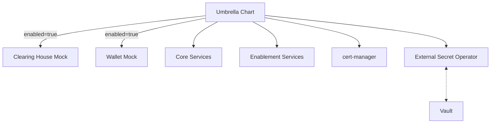

# 1. Business Case

The Tractus-X Umbrella Helm Chart is a foundational deployment tool for Tractus-X infrastructure. 
To meet TRL 7 maturity, it must support fully automated, cloud-native deployment and secure secret management. 
This solution concept enables deployment across cloud environments and interacts with critical components like Vault, ArgoCD, and a BYO Clearing House.

# 2. Requirements Analysis

## 2.1 Premises

- Kubernetes clusters (INT and STABLE) are provided and maintained by CATENA-X e.V.
  - ℹ️ currently no plan to change int deployment to umbrella helm chart
- Networking and ingress via NGINX are already configured.
- ArgoCD is installed and preconfigured; no customizations will be made.
- Vault is available and configured in ArgoCD
- We use the mocks for Clearing House and Wallet already used in the umbrella chart. 
- Only Enablement and Core Services are in scope.

## 2.2 Requirements Catalog

### **Solution Concept for Umbrella HELM Charts**

- Analysis and evaluation of the existing Umbrella HELM Charts with respect to their suitability for deployment in a cloud infrastructure.
- Identification and description of necessary adjustments to the HELM Charts, considering configuration, architectural, and cloud-specific requirements.
- Examination of security-relevant aspects such as secrets management and development of optimization proposals.
- Analysis of limitations that hinder or prevent deployment in test environments and TRL 7 cloud environments.
- Development of an implementation concept with actionable recommendations for cloud optimization of the Umbrella HELM Charts.

### **Deployment of the Umbrella HELM Charts on Kubernetes**

- Deployment of the Umbrella HELM Charts to a provided Kubernetes environment in a cloud setting.
- Integration with an existing **HashiCorp Vault** system for secrets management.
- Integration into an existing, pre-configured **ArgoCD** setup for continuous delivery.
- Support for **BYO (Bring Your Own)** Clearing House integration.
  - Integration with an existing **ArgoCD**
  - Connection to a **Vault system** for secrets
  - **BYO Clearing House** integration
  - Creation of a **documented, repeatable installation** process

### **Deployment of a HashiCorp Vault**

- Implementation of the deployment of a HashiCorp Vault.
- Setup and configuration of the Vault for operation in both INT and STABLE environments.
- Integration of the Vault into the existing Umbrella HELM Chart.
- Documentation of the deployment and integration for operations and further development.
- Execution of a **knowledge transfer** for working with Vault.
- Ensuring the use of Vault secrets within the defined components.
- Secure secrets management for **Tractus-X components** in Kubernetes
- Setup of a Vault instance for INT and STABLE environments
- Integration with the Umbrella HELM Chart
- Configuration of **product-specific namespaces**
- Creation of **deployment and operations documentation**

### **TLS Encryption Within the Cluster**

- Implementation of a suitable architecture for TLS-encrypted communication within the cluster.
- Selection and deployment of a certificate authority within the existing Kubernetes environment.
- Configuration for the automatic issuance, renewal, and management of TLS certificates for cluster services.
- Configuration of Ingress controllers and services to use TLS certificates.
- Definition of certificate policies (e.g., validity periods, renewal intervals).
- Documentation of installation, configuration, and operational processes.

# 3. Current Situation

## 3.1 Process

### 3.1.1 Use Case View

- Local Helm-based deployments using hardcoded values.
- TLS and Vault are not yet integrated.

### 3.1.2 Business Process View

- Developers manually deploy Umbrella Chart to local clusters.
- Configurations are maintained in static files.

## 3.2 Configuration & Secrets

### 3.2.1 Helm Values

- Lacks environment-specific profiles.
- Hardcoded secrets not suitable for cloud environments.

### 3.2.2 Secrets Management

- No Vault support in the existing umbrella chart
  - ℹ️ there is vault support, but it's not being used
- Secrets stored plain in values.yaml

### 3.2.3 Security

- TLS not enforced internally.
- Secrets exposed in plaintext.

## 3.3 System

### 3.3.1 Context Delimitation

- Components deployed via Helm in one namespace.
- Wallet and Clearing House are mocked.

### 3.3.2 Interfaces

- Local Kubernetes Cluster

## 3.4 Decision on Solution

### 3.4.1 Decision Matrix for Solution Alternatives

# 4. Future Design

## 4.1 Process

### 4.1.1 Target Use Case

- Deploy via ArgoCD to a kubernetes cluster (env to be determined)
- Secret management using the External Secrets Operator (ESO). Secrets are stored in a Vault
- TLS via cert-manager and internal CA.
- Fully documented, repeatable process.

## 4.2 Configuration & Secrets

### 4.2.1 Configuration

- Environment-specific values files (?) TBD which env
- Global vs. component-level settings

### 4.2.2 Secrets management

Use of External Secrets Operator to manage injection of secrets from a Vault into Kubernetes Secrets.
To ensure full functionality, we need to verify that all the subcharts of the umbrella chart correctly use secrets in their templating.
If **actual** secrets are not yet injected via secret reference or if secrets are injected via secret reference but the secret name cannot be changed, a GitHub Issue has to be created in the product repository.
The External Secrets Operator manages pulling the secrets from the vault and putting them into kubernetes secrets. 
The umbrella values have to be adjusted to override the k8 secret names, created by the External Secrets Operator.
The External Secrets Operator has to be used in a way which still allows deployment of the umbrella chart on argoCD with the vault plugin templating.
If possible, the External Secrets Operator should be part of the helm umbrella helm chart.

For more detailed information on the secrets management approach, see the [Architectural Decision Record on Secret Management](adr-secret-management.md).

### 4.2.3 TLS Policies

- Internal CA via cert-manager.
- Automatic renewal.
- No external CA or app-level changes.

## 4.3 System

### 4.3.1 Helm Chart Architecture

#### Selective enablement for BYO integrations (Clearing House, Wallet)

- Usage of boolean flags to enable/disable Mocks
- Documentation makes clear where to configure BYO components

#### Reusable base values & overrides

- Layered value model
  1. `values.yaml` – sane defaults for local dev
  2. `values-<env>.yaml` – environment specific settings
- No secrets inside values files; only references to ESO-created K8s Secrets

#### Chart structure

- One umbrella chart that lists all sub-charts in `Chart.yaml`

#### Upgrade

- CRDs and `ExternalSecret` resources installed by a `pre-install,pre-upgrade` hook

#### Packaging & release flow

- CI pipeline runs `helm lint`, chart-testing, and uploads OCI artifacts (chart-releaser)
- SemVer tagging drives downstream consumption

#### Overview of the resulting chart structure

### 4.3.2 Interfaces

| Interface                       | Responsibility                                   | Key Touch Points                                                               |
|---------------------------------|--------------------------------------------------|--------------------------------------------------------------------------------|
| Helm                            | Package definition, rendering, release lifecycle | `helm upgrade --install` locally, or executed by ArgoCD controller             |
| ArgoCD                          | GitOps controller, sync orchestration            | Watches Git → applies Helm chart                                               |
| External Secrets Operator (ESO) | Sync secrets from Vault into K8s Secrets         | Authenticates to Vault with SA token; watches `ExternalSecret` CRDs.           |
| Vault                           | Central secret store                             | ESO retrieves Vault tokens and materialises secrets as K8s Secrets.            |
| cert-manager                    | Cluster-internal CA & automatic TLS              | `Issuer` ↔ `Certificate` ↔ `Secret`  Ingress resources refer to that Secret |
| Kubernetes                      | Runtime substrate                                | Deployments, Services, Secrets produced by Helm/ArgoCD                         |

### 4.3.3 Security Model

- TLS on ingresses
  - Terminate HTTPS at NGINX Ingress; all external traffic is encrypted
  - cert-manager + internal CA issue/rotate 90-day certs automatically
  - Enforce HSTS, modern ciphers, redirect 80 → 443

- Vault for secrets
  - External Secrets Operator syncs Vault → K8s Secrets
  - Secrets are never stored in Git; rotation is handled by Vault

### 4.3.4 TLS Infrastructure

Encrypt every request **up to the cluster edge** while keeping in-cluster traffic simple (HTTP).  
TLS is therefore terminated once – at the NGINX Ingress Controller.

#### Building Blocks

| Component                              | Purpose                                                                              |
|----------------------------------------|--------------------------------------------------------------------------------------|
| NGINX Ingress Controller               | Listens on 443, terminates TLS, forwards HTTP to services                            |
| cert-manager                           | Issues, renews and stores X.509 certificates in Kubernetes secrets                   |
| Internal CA (cert-manager `CA` issuer) | Signs all ingress certificates; root key kept in Vault via External Secrets Operator |

#### Traffic Flow

External Client → **HTTPS** → NGINX Ingress → **HTTP** → Pod/Service

Only the edge hop is encrypted; everything after the ingress runs on plain HTTP.

#### Operational Setup (high level)

1. Deploy cert-manager cluster-wide (one Helm chart, no app changes).
2. (Optional) Store the CA key-pair in Vault; sync it into the cluster as a secret via ESO.
3. Create a ClusterIssuer referencing that secret.
4. Annotate each Ingress:  
   `cert-manager.io/cluster-issuer: internal-ca`
5. NGINX automatically picks the certificate secret generated by cert-manager.

#### Certificate Policy

- Ingress cert validity: **90 days** (auto-renew when <30 days)
- CA cert validity: **1 year**
- Key algorithms: RSA-2048 or ECDSA-P256
- SANs: hostnames defined in the Ingress resource

Everything is fully automated—no manual key handling inside pods.

#### Lifecycle Summary

Provision → cert-manager creates secret → NGINX mounts secret → cert-manager renews → secret updated → NGINX reloads (hot) → unused certs garbage-collected.

#### Why This Matters

- Centralized TLS management (single touch point).
- Zero application changes (pods stay on HTTP).
- Consistent security posture via internal CA and Vault.

### 4.3.5 Namespace Strategy

Lean, capability-driven isolation that scales from local dev to production.

#### Core Principles

- **Capability first**: one namespace per capability; never per product.
- **Core namespace**: hosts only core + enablement services.

#### Development vs. future Production Scenarios

| Phase            | Approach                        | Why                                              |
|------------------|---------------------------------|--------------------------------------------------|
| Dev/local        | Single namespace, full umbrella | Simplest feedback loop, zero isolation overhead  |
| future prod-like | Capability-based namespaces     | Security, RBAC clarity, blast-radius containment |

#### Secret Management Alignment

- Vault path hierarchy mirrors namespaces:  
  `/<capability>/<product>/<secret>`
- External Secrets Operator (ESO) maps each Vault path to the matching namespace secret.

# 5. Build

## 5.1 Tooling

- Helm
- ArgoCD (preconfigured)
- cert-manager (internal CA)
- Vault (preconfigured)
- Kubernetes
- GitHub Actions

# 6. Quality Assurance

## 6.1 Process

- Helm linting and validation
- Ephemeral testing via Kind or Minikube
- No formal test management process in scope

## 6.2 Testing Strategy

### Test Types

- **Static Tests**: Template rendering and linting
- **Integration Tests**: Chart installation and basic functionality
- **Smoke Tests**: Basic connectivity via ingress

### Test Scenarios

- **Deployment validation** – Helm chart deploys successfully
- **TLS verification** – TLS certificates are provisioned correctly
- **Smoke tests** – Services are accessible through ingress
- **E2E tests** – Basic EDC communication flows work

### Testdata seeding

The umbrella chart ships with pre-configured testdata which is intended to showcase an example dataspace with companies already created in the portal.
To test the chart, e.g., for smoke tests, this testdata can be reused – with the option to disable it entirely for a clean environment.  
Most of the components already support disabling the seeding, but this needs to be verified for all components.

### Automation

- **GitHub Actions**: Automated testing on PRs and main branch
- **Local Testing**: Kind/Minikube for development
- **Basic CI Pipeline**:
  - Helm template validation
  - Chart installation testing
  - Service connectivity checks

### Success Criteria

- Chart deploys without errors
- All services start and respond to health checks
- Basic inter-service communication works
- TLS certificates are valid

# 7. Project Management

## 7.1 Stakeholder Analysis

- Infra (Vault, ArgoCD): CATENA-X e.V.
- Chart Owners: Umbrella maintainers
- Lead: TAP7.1 Lead
- Umbrella Lead
- Product teams 
  - For potential changes to helm charts 
  - Regarding vault secret management. Some teams use the vault for more than pure secrets, so if this requires changes to deployment setups, this needs to be communicated.
- Testmanagement
  - Potential requirements for automation of int/stable environment

## 7.2 Open Items List and Decision Log

### Decided Items

- **Secret integration strategy**  
**Decision**: Implement external secrets operator for secure secret management integration
- **Clearing House configuration**  
**Decision**: Use the existing mock implementation for Clearing House configuration and credentials
- **Wallet access and configuration**  
**Decision**: Start with mock wallet implementation while ensuring BYO (Bring Your Own) wallet capability is enabled through configurable options
- **Helm post-install jobs compatibility**  
**Decision**: Validate and test post-install job functionality in ArgoCD environment before implementation
- **Vault Secret Management Implementation**  
    - **ArgoCD-Vault Integration**: Utilize external secrets operator to eliminate direct vault plugin dependencies
    - **Secret Storage Strategy**: Store secrets in vault grouping by capability and product
    - **Secret Scope**: Handle all sensitive configuration including wallet credentials, clearinghouse settings, passwords, and API keys through vault. Only sensitive configuration is stored in the vault.

- **Infrastructure provisioning responsibility**  
**Decision**: doubleSlash team is responsible for requesting access through testmanagement or directly via CATENA-X e.V. Local development environment setup takes priority while cloud infrastructure access is arranged
- **Deployment strategy**  
**Decision**: Maintain Kubernetes compatibility as the primary deployment method while ensuring ArgoCD deployment remains possible to avoid architectural constraints
- **Database persistence strategy**  
**Decision**: Use in-memory variant for initial development phases, as production-ready persistent storage is not required for early iterations
- **Infrastructure chart organization**  
**Decision**: Evaluate creating a dedicated chart for infrastructure components (external secrets operator, cert-manager) to separate umbrella functionality from infrastructure setup requirements

## 7.3 Risk List

### Identified Risks and Mitigation Strategies

- **ArgoCD post-install script compatibility**  
**Risk**: Post-install scripts currently incompatible with ArgoCD deployment  
**Mitigation**: Thorough testing in ArgoCD environment before production deployment
- **Infrastructure availability constraints**  
**Risk**: Delays in cloud infrastructure provisioning  
**Mitigation**: Proceed with local development while infrastructure access is secured
- **Vault-ArgoCD integration complexity** _(Risk Resolved)_  
**Previous Risk**: Direct vault connection to existing ArgoCD setup  
**Resolution**: External secrets operator eliminates this integration complexity
- **BDRS deployment limitations** _(Risk Accepted)_  
**Previous Risk**: Difficulty deploying BDRS with dedicated database and vault  
**Resolution**: In-memory variant meets current project requirements and reduces complexity

## 8. Documentation & Compliance

### 8.1 Open Source Compliance

- SPDX headers in all source files
- Apache 2.0 license for Code included
- CC-BY-4.0 license for non-Code included

### 8.2 Documentation Assets

- Architecture Decision Records (ADRs)
- Testing and release documentation

## NOTICE

This work is licensed under the [CC-BY-4.0](https://creativecommons.org/licenses/by/4.0/legalcode).

* SPDX-License-Identifier: CC-BY-4.0
* SPDX-FileCopyrightText: 2025 Contributors to the Eclipse Foundation
* Source URL: <https://github.com/eclipse-tractusx/tractus-x-umbrella>
