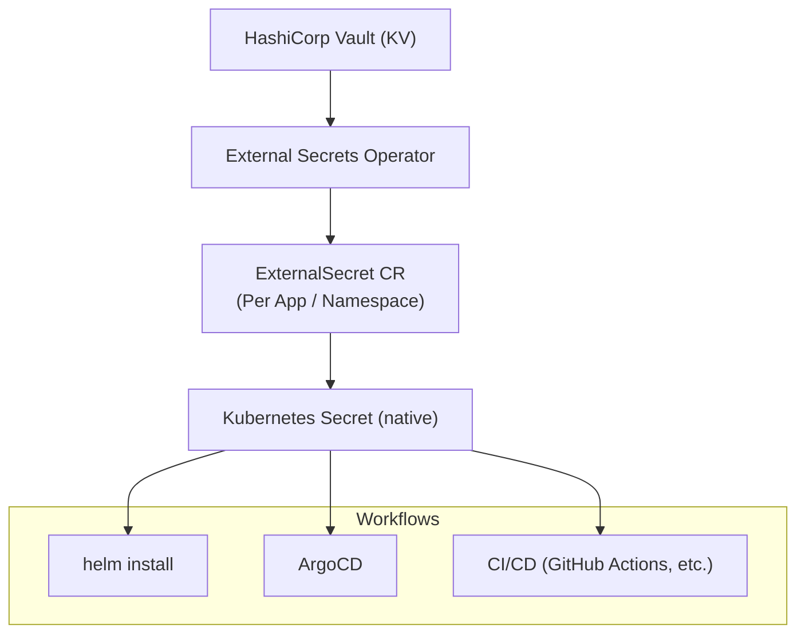

# Decision Record: Secrets management with External Secrets Operator (ESO)

## Metadata

* Date: 2025-07-09
* Dependencies: Kubernetes, HashiCorp Vault, ArgoCD, Helm
* Target group: Platform engineering, DevOps, Application teams

## Problem statement

The current setup uses an umbrella Helm chart for local deployments, where secrets are hardcoded. The goal is to make the deployment cluster-ready for production use.

To achieve this, it was initially considered adopting the ArgoCD Vault Plugin — as used in standard ArgoCD-based GitOps workflows — to provide secret injection at deployment time. However, the plugin is **not currently in use for the umbrella chart**, since the current use case is limited to local development only.

Integrating the ArgoCD Vault Plugin into the umbrella chart for cluster readiness would introduce additional complexity, such as Vault configuration, plugin setup, and runtime token handling inside ArgoCD. Furthermore, this solution does not support Helm CLI workflows or alternative CI/CD pipelines without duplicating logic and configuration.

Therefore, a more scalable and Kubernetes-native approach for secret management is needed to simplify the setup and improve flexibility, while supporting both GitOps and manual deployment strategies.

## Evaluation criteria

- Compatibility with both ArgoCD and standalone Helm workflows
- Kubernetes-native lifecycle management of secrets
- Declarative infrastructure and GitOps friendliness
- Minimal or no changes to existing Helm charts
- Ease of management and scalability
- Support for multiple namespaces and secret backends

## Possible solutions

### Solution 1: Use ArgoCD Vault Plugin

- Injects secrets into Helm values at deployment time via ArgoCD
- Familiar in standard GitOps setups
- Was considered for the umbrella chart, but not currently in use
- Requires additional setup (Vault config, plugin init, runtime token)
- Coupled tightly to ArgoCD, not usable via `helm install`
- Secrets need to be available at ArgoCD runtime

### Solution 2: Use External Secrets Operator (ESO)

- Secrets are synced from Vault into Kubernetes Secrets using ESO
- Secrets are referenced in `values.yaml` via `secretKeyRef`
- Compatible with ArgoCD, Helm CLI, and other CI/CD workflows
- Kubernetes-native, secure, and declarative
- Supports multiple backends and namespaces
- Removes dependency on ArgoCD for Vault access

## Decision: Use External Secrets Operator (ESO)

### Rationale

ESO was chosen because it supports the desired target state: cluster-ready deployments that can be used with both GitOps (ArgoCD) and Helm CLI workflows. It eliminates the complexity of setting up Vault integration within ArgoCD and removes runtime dependency on Vault tokens inside ArgoCD pipelines.

In addition, ESO enables us to keep the umbrella Helm chart as **simple and portable as possible**. It removes the need to hardcode Vault-specific logic or integrate tightly with ArgoCD, thus reducing overall complexity. While it's still possible to use the ArgoCD Vault Plugin if needed in certain projects, ESO makes it unnecessary for the umbrella chart and promotes a clean separation of concerns.

### Actions

- Install ESO in all target Kubernetes clusters
- Define and apply `ClusterSecretStore` and `ExternalSecret` CRs per app/environment
- Update umbrella Helm chart `values.yaml` to refer to Kubernetes secrets
- Update platform and deployment documentation accordingly

### Consequences

- Helm charts remain unchanged; secret values are referenced from K8s secrets
- Local and cluster-ready deployments are unified under a common secret model
- ArgoCD setups no longer require Vault plugin complexity
- ESO becomes the standard secret integration layer
- The umbrella chart avoids introducing extra dependencies and stays minimal and reusable

---

## Diagram: Secrets Management with ESO

---

## NOTICE

This work is licensed under the [CC-BY-4.0](https://creativecommons.org/licenses/by/4.0/legalcode).

* SPDX-License-Identifier: CC-BY-4.0
* SPDX-FileCopyrightText: 2025 Contributors to the Eclipse Foundation
* Source URL: <https://github.com/eclipse-tractusx/tractus-x-umbrella>
