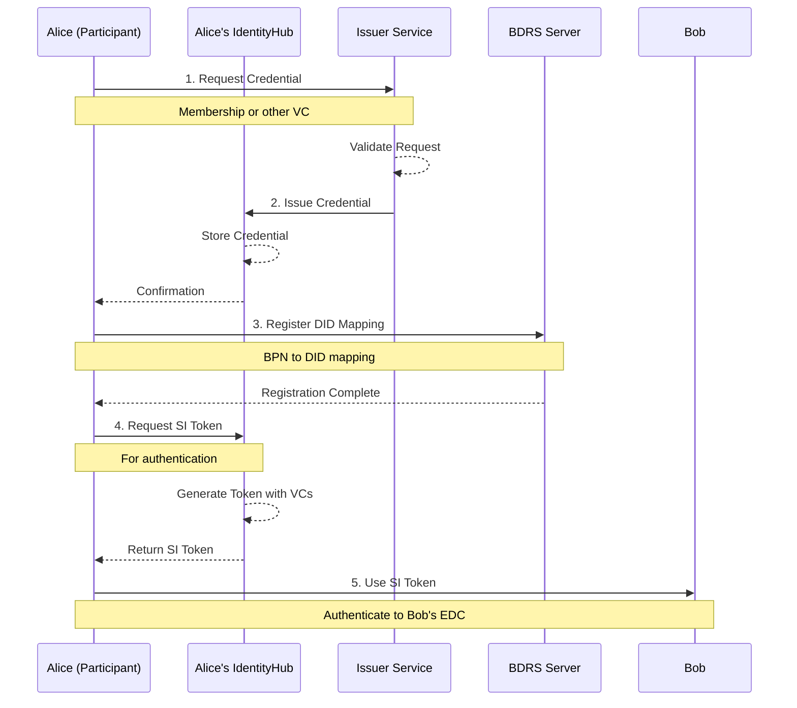

# Credential Issuance

This documentation guides you through the process of issuing and managing verifiable credentials using the IdentityHub in a decentralized identity architecture.

> **Actors in this guide**
> 
> - **Issuer Service**: Trusted credential issuer, reachable via `http://issuerservice.issuance.local`
> - **Alice**: Data consumer participant, DID: `did:web:consumer.local:identityhub:BPNL000000000002`
> - **Bob**: Data provider participant, DID: `did:web:provider.local:identityhub:BPNL000000000001`
> - **BDRS**: BPN/DID Resolution Service for mapping Business Partner Numbers to Decentralized Identifiers

This diagram shows the credential issuance and usage flow where:
1. Alice requests a verifiable credential from a trusted issuer
2. The issuer validates the request and issues the credential to Alice's IdentityHub
3. Alice registers her DID in the BDRS for discovery by other participants
4. Alice requests a Self-Issued (SI) token from her IdentityHub for authentication
5. Alice uses the SI token to authenticate with Bob's connector

## Credential Issuance Workflow

### 1. Request Verifiable Credential

A participant requests a verifiable credential from a trusted issuer service. The credential proves membership in the dataspace or specific claims about the participant.

### 2. Store Credential in IdentityHub

Once issued, the credential is stored in the participant's IdentityHub for future use in authentication and authorization.

### 3. Register DID in BDRS

The participant registers their Business Partner Number (BPN) to Decentralized Identifier (DID) mapping in the BDRS so other participants can discover them.

### 4. Request Self-Issued Token

When authenticating with another connector, the participant requests a Self-Issued (SI) token from their IdentityHub. This token includes verifiable presentations of the stored credentials.

### 5. Use Token for Authentication

The SI token is used to authenticate when:
- Querying another participant's catalog
- Negotiating contracts
- Initiating data transfers

## Testing Credential Issuance

For detailed API testing and credential management operations, use the Bruno collection:

**[Bruno Collection](../../../common/api/README.md)**

The Bruno collection includes pre-configured requests in the **Issuance** folder for:
- **IssuerCreateParticipantContext**: Create participant context in the issuer service
- **CreateAttestation**: Create attestations for participants
- **AddMembershipCredentials**: Issue membership credentials to participants
- **AddBPNCredential**: Issue BPN credentials
- **AddUsagePurposeCredentials**: Issue usage purpose credentials
- **AddDataExchangeCredentials**: Issue data exchange credentials
- **AddConsumerHolder**: Add holder information for consumer
- **AddProviderHolder**: Add holder information for provider
- **IssuanceProcessConsumer**: Complete issuance process for consumer
- **IssuanceProcessProvider**: Complete issuance process for provider
- **IdHConsumerVC**: Retrieve consumer's verifiable credentials from IdentityHub
- **IdHProviderVC**: Retrieve provider's verifiable credentials from IdentityHub

## Notes

- Credentials must be issued by trusted issuers configured in the `trustedIssuers` list
- Self-Issued tokens have a default lifetime of 300 seconds (5 minutes)
- Revoked credentials will fail verification and cannot be used
- Each participant must register their DID in BDRS for discovery
- The `did:web` method resolves DIDs via HTTP/HTTPS based on the domain in the DID

## NOTICE

This work is licensed under the [CC-BY-4.0](https://creativecommons.org/licenses/by/4.0/legalcode).

* SPDX-License-Identifier: CC-BY-4.0
* SPDX-FileCopyrightText: 2026 Contributors to the Eclipse Foundation
* Source URL: <https://github.com/eclipse-tractusx/tractus-x-umbrella>
