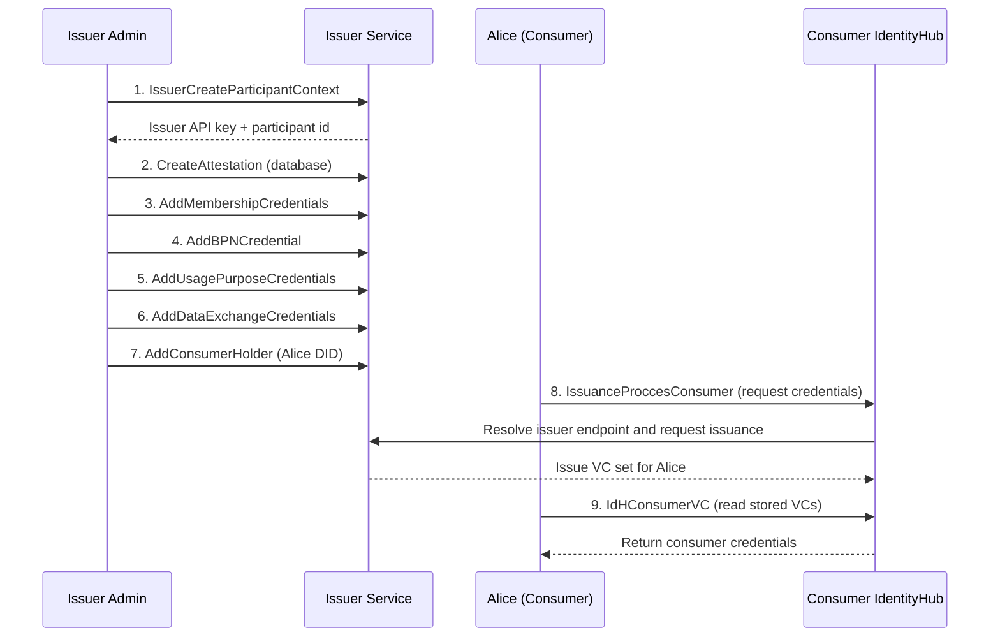
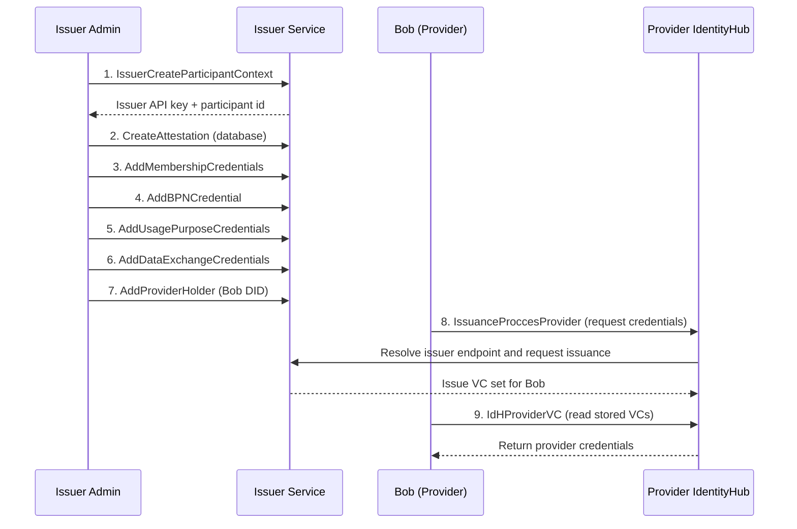

# Credential Issuance

This documentation guides you through the process of issuing and managing verifiable credentials using the IdentityHub in a decentralized identity architecture.

> **Actors in this guide**
> 
> - **Issuer Service**: Trusted credential issuer, reachable via `http://issuerservice.local`
> - **Alice**: Data consumer participant, DID: `did:web:consumer.local:identityhub:BPNL000000000002`
> - **Bob**: Data provider participant, DID: `did:web:provider.local:identityhub:BPNL000000000001`
> - **Consumer IdentityHub**: IdentityHub instance used by Alice
> - **Provider IdentityHub**: IdentityHub instance used by Bob

### Consumer Issuance Sequence

### Provider Issuance Sequence

These diagrams show the same Bruno **Issuance** setup split by participant path:
1. Issuer bootstrap and credential definitions are created
2. The participant-specific holder is registered
3. The participant requests credential issuance via IdentityHub
4. Issued credentials are retrieved from IdentityHub for verification

## Credential Issuance Workflow

### 1. Bootstrap Issuer Participant Context

Create the issuer participant context (`IssuerCreateParticipantContext`) and capture the returned API key and participant id for subsequent admin requests.

### 2. Configure Attestation and Credential Definitions

Create one attestation (`CreateAttestation`) and register credential definitions:
- `AddMembershipCredentials`
- `AddBPNCredential`
- `AddUsagePurposeCredentials`
- `AddDataExchangeCredentials`

### 3. Register Credential Holders

Register both holder identities at the issuer:
- `AddConsumerHolder` (Alice)
- `AddProviderHolder` (Bob)

### 4. Trigger Issuance from IdentityHub

Request credential issuance for each participant:
- `IssuanceProccesConsumer`
- `IssuanceProccesProvider`

Each request asks for the configured VC types (Membership, UsagePurpose, DataExchangeGovernance, BpnCredential).

### 5. Validate Issued Credentials in IdentityHub

Read back stored credentials from each IdentityHub:
- `IdHConsumerVC`
- `IdHProviderVC`

## Testing Credential Issuance

For detailed API testing and credential management operations, use the Bruno collection:

**[Bruno Collection](../../../common/api/README.md)**

The Bruno collection includes pre-configured requests in the **Issuance** folder for:
- **IssuerCreateParticipantContext**: Create participant context in the issuer service
- **CreateAttestation**: Create attestations for participants
- **AddMembershipCredentials**: Issue membership credentials to participants
- **AddBPNCredential**: Issue BPN credentials
- **AddUsagePurposeCredentials**: Issue usage purpose credentials
- **AddDataExchangeCredentials**: Issue data exchange credentials
- **AddConsumerHolder**: Add holder information for consumer
- **AddProviderHolder**: Add holder information for provider
- **IssuanceProcessConsumer**: Complete issuance process for consumer
- **IssuanceProcessProvider**: Complete issuance process for provider
- **IdHConsumerVC**: Retrieve consumer's verifiable credentials from IdentityHub
- **IdHProviderVC**: Retrieve provider's verifiable credentials from IdentityHub

## Notes

- Credentials must be issued by trusted issuers configured in the `trustedIssuers` list
- Revoked credentials will fail verification and cannot be used
- The `did:web` method resolves DIDs via HTTP/HTTPS based on the domain in the DID

## NOTICE

This work is licensed under the [CC-BY-4.0](https://creativecommons.org/licenses/by/4.0/legalcode).

* SPDX-License-Identifier: CC-BY-4.0
* SPDX-FileCopyrightText: 2026 Contributors to the Eclipse Foundation
* Source URL: <https://github.com/eclipse-tractusx/tractus-x-umbrella>
