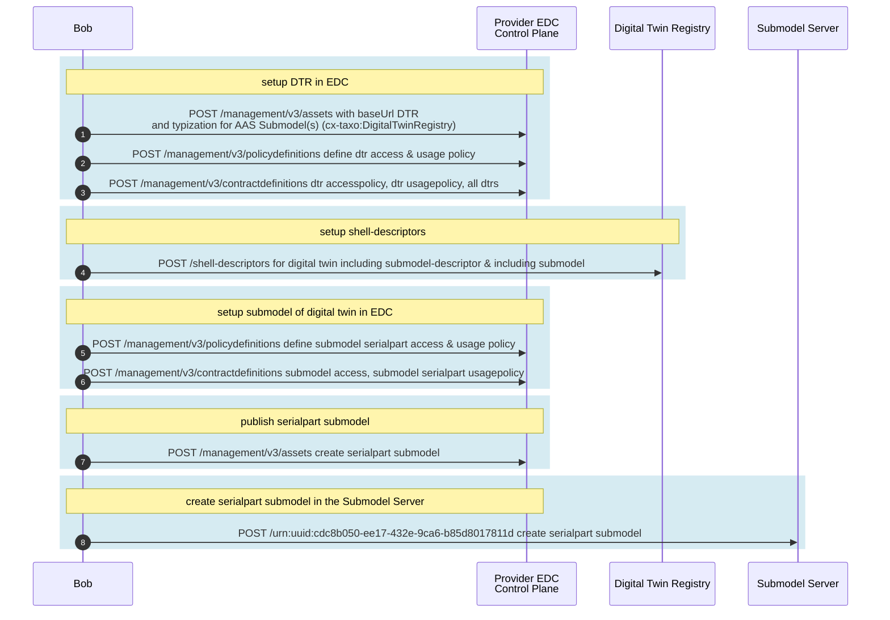

# Provide Digital Twins

This documentation guides you through the process of creating and providing digital twins in a local dataspace using the Eclipse Dataspace Connector (EDC).
You need to configure the following components to implement this example: 
    
* **Digital Twin Registry (DTR)** - to create and publish digital twins
* **Submodel Server** - to create and provide data (so-called submodels) for digital twins based on aspect models
* **EDC** - to connect DTR and Submodel Server to your local dataspace. Both components, DTR and Submodel Server are only accessible via the EDC.


> **cURL explanation**
>
> 1. **URL and Method**:
>    - `-L`: Ensures redirections are followed if the URL returns a redirect response.
>    - `-X POST`: Specifies the HTTP method as `POST`.
>
> 2. **Headers**:
>    - `-H 'Content-Type: application/json'`: Indicates that the payload is in JSON format.
>    - `-H 'X-Api-Key: TEST2'`: Sends an API key for authentication.
>
> 3. **Payload**:
>    - `--data-raw`: Includes the JSON payload to be sent with the `POST` request.
> 
> 4. **Piping into `jq`**:
>    - The output is piped into `jq` to format and colorize the JSON response for easier reading. 
>
> Variables enclosed in {{ }} mean that they are whose content has been obtained from the answers of previous calls.
>

> **Actors in this guide**
> 
> - **Bob**: data provider, is reachable via `http://dataprovider-controlplane.tx.test`
> - **Alice**: data consumer, is reachable via `http://dataconsumer-1-controlplane.tx.test`
> - **DTR**: digital twin registry, is reachable via `http://dataprovider-dtr.test`
> - **Submodel Server**: Submodel Server, is reachable via `http://dataprovider-submodelserver.tx.test`

The following figure illustrates the setup process:



## Setup DTR in EDC 

### Create DTR Asset

In the initial step, an EDC asset must be created for the decentralized Digital Twin Registry. This foundational step is necessary to establish a contract definition in the subsequent phase. This lays the groundwork for data consumers to access the decentralized Digital Twin Registry (dDTR) through the EDC. The following JSON can be utilized to create the dDTR asset.

```bash
curl -L -X POST 'http://dataprovider-controlplane.tx.test/management/v3/assets' \
  -H 'Content-Type: application/json' \
  -H 'X-Api-Key: TEST2' \
  --data-raw '{
      "@context": {
        "edc": "https://w3id.org/edc/v0.0.1/ns/",
        "cx-common": "https://w3id.org/catenax/ontology/common#",
        "cx-taxo": "https://w3id.org/catenax/taxonomy#",
        "dct": "http://purl.org/dc/terms/"
      },
      "@id": "200",
      "properties": {
        "dct:type": {
          "@id": "cx-taxo:DigitalTwinRegistry"
        },
        "cx-common:version": "3.0"
      },
      "privateProperties": {
      },
      "dataAddress": {
        "@type": "DataAddress",
        "type": "HttpData",
        "baseUrl": "http://dataprovider-dtr.test",
        "proxyQueryParams": "true",
        "proxyPath": "true",
        "proxyMethod": "false"
      }
    }' | jq
```
**Important:** 
The dct:type MUST be set to **cx-taxo:DigitalTwinRegistry**"

## Create dDTR Polcies
### Access Policy for dDTR
For this example, we will use an access policy that checks if the requestor is Alice. Only Alice will be able to view the contract offer. For all other requestors, the offer will not be visible.

The following command can be utilized to create the access policy. 
```bash
curl -L -X POST 'http://dataprovider-controlplane.tx.test/management/v3/policydefinitions' \
  -H 'Content-Type: application/json' \
  -H 'X-Api-Key: TEST2' \
  --data-raw '{
    "@context": {
      "odrl": "http://www.w3.org/ns/odrl/2/"
    },
    "@type": "PolicyDefinitionRequestDto",
    "@id": "access-policy",
    "policy": {
      "@type": "odrl:Set",
      "odrl:permission": [
        {
          "odrl:action": "USE",
          "odrl:constraint": {
            "@type": "LogicalConstraint",
            "odrl:or": [
              {
                "@type": "Constraint",
                "odrl:leftOperand": {
                  "@id": "BusinessPartnerNumber"
                },
                "odrl:operator": {
                  "@id": "odrl:eq"
                },
                "odrl:rightOperand": "BPNL00000003AZQP"
              }
            ]
          }
        }
      ]
    }
  }' | jq
  ```
### Usage Policy for dDTR

The usage policy defines the conditions under which data from the decentralized Digital Twin Registry (dDTR) may be utilized. By using a standardized purpose such as **"cx.core.digitalTwinRegistry:1"**, it ensures that all providers within the Catena-X ecosystem employ a consistent usage policy. This enhances the transparency and trustworthiness of the system.

```bash
curl -L -X POST 'http://dataprovider-controlplane.tx.test/management/v3/policydefinitions' \
  -H 'Content-Type: application/json' \
  -H 'X-Api-Key: TEST2' \
  --data-raw '{
  "@context": {
    "@vocab": "https://w3id.org/edc/v0.0.1/ns/",
    "edc": "https://w3id.org/edc/v0.0.1/ns/",
    "cx-policy": "https://w3id.org/catenax/policy/",
    "odrl": "http://www.w3.org/ns/odrl/2/"
  },
  "@id": "USEAGEPOLICYIDfordDTR",
  "policy": {
    "@type": "odrl:Set",
    "odrl:permission": {
      "odrl:action": {
        "@id": "odrl:use"
      },
      "odrl:constraint": {
        "odrl:and": [          
          {
            "odrl:leftOperand": {
              "@id": "cx-policy:UsagePurpose"
            },
            "odrl:operator": {
              "@id": "odrl:eq"
            },
            "odrl:rightOperand": "cx.core.digitalTwinRegistry:1"
          }
        ]
      }
    }
  }
}' | jq
```
## Creating a dDTR Contract Definition

In common a contract definition always consists out of 1 to n assets, an access policy and 1 to n usage policies. So you should first create a access and usage policy for your registry (like shown above). In common policies can be reused, but please do not reuse the usage policy of the registry for other contract definitions as the purpose of the usage is focused on the dDTR use!

```bash
curl -L -X POST 'http://dataprovider-controlplane.tx.test/management/v3/contractdefinitions' \
  -H 'Content-Type: application/json' \
  -H 'X-Api-Key: TEST2' \
  --data-raw '{
  "@id": "Contract-Definition-Digital-Twin-Registry",
  "@type": "ContractDefinition",
  "accessPolicyId": "access-policy",
  "contractPolicyId": "USEAGEPOLICYIDfordDTR",
  "assetsSelector": {
    "@type": "Criterion",
    "operandLeft": "http://purl.org/dc/terms/type",
    "operator": "like",
    "operandRight": "%https://w3id.org/catenax/taxonomy#DigitalTwinRegistry%"
  },
  "@context": {
    "@vocab": "https://w3id.org/edc/v0.0.1/ns/",
    "edc": "https://w3id.org/edc/v0.0.1/ns/",
    "tx": "https://w3id.org/tractusx/v0.0.1/ns/",
    "tx-auth": "https://w3id.org/tractusx/auth/",
    "cx-policy": "https://w3id.org/catenax/policy/",
    "odrl": "http://www.w3.org/ns/odrl/2/"
  }
}' | jq
```
## Filter for the dDTR Offer

If everything is setup like described above, a data consumer should find the dDTR offer in the catalogue with the the catalogue request with the filter expression shown in the example. The filter uses the dct type to filter for the registry offer.

```bash
curl -L -X POST 'http://dataconsumer-1-controlplane.tx.test/management/v3/catalog/request' \
  -H 'Content-Type: application/json' \
  -H 'X-Api-Key: TEST1' \
  --data-raw '{
  "@context": {
    "dct": "http://purl.org/dc/terms/"
  },
  "protocol": "dataspace-protocol-http",
  "counterPartyAddress": "http://dataprovider-controlplane.tx.test/api/v1/dsp",
  "counterPartyId": "BPNL00000003AYRE",
  "querySpec": {
    "@type": "QuerySpecDto",
    "https://w3id.org/edc/v0.0.1/ns/offset": 0,
    "https://w3id.org/edc/v0.0.1/ns/limit": 10,
    "https://w3id.org/edc/v0.0.1/ns/filterExpression": {
      "@type": "CriterionDto",
      "operandLeft": "http://purl.org/dc/terms/type",
      "operator": "like",
      "operandRight": "%https://w3id.org/catenax/taxonomy#DigitalTwinRegistry%"
    }
  }
}' | jq
```

## Register Digital Twins in DTR

Registering digital twins in the DTR is straight forward. For convenience for this example, we register every digital twin in one step, i.e., including all submodel descriptors. The DTR API also allows you to create the digital twin in multiple steps.  Some additional explanatory notes:

* The property idShort of a digital twin entry must be unique. So we added a date counter (e.g., "Vehicle 2024-01-01-0001" instead of just "Vehicle").
* The visibility of certain attributes must be restricted. For example, not all specific asset IDs of a digital twin are allowed to be public readable. For this example, we still made all IDs public. Otherwise, we would have needed to add visibility permissions to the digital twin whenever a new partner wants to access the example. To limit visibility, you would use the property externalSubjectId. Here's an example that grants Alice with BPN BPNL00000003AZQP access to the specific asset ID partInstanceId:

```json

{
    "name": "partInstanceId",
    "value": "T588540140123B1011B018362515271",
    "externalSubjectId": {
    "type": "ExternalReference",
    "keys": [
        {
            "type": "GlobalReference",
            "value": "BPNL00000003AZQP"
        }
    ]

```
More details about digital twin visibility can be found in the documentation of the Catena-X [OpenSource DTR](https://github.com/eclipse-tractusx/sldt-digital-twin-registry/blob/main/docs/architecture/6-crosscutting-concepts.md#access-control-to-digital-twins-based-on-the-bpn-business-partner-number-tenantid).

### Registering the Vehicle Digital Twin (Part Instance)
The following example shows the full digital twin for a Vehicle including submodel descriptors for SerialPart and SingelLevelBomAsBuilt submodels. This digital twin is registered using the method **POST /shell-descriptors** of the DTR API.

* Mandatory and optional specific asset IDs depend on the actual type of the part for which the digital twin is created: serial part, batch, or Just-In-Sequence part. More details can be found [here](https://eclipse-tractusx.github.io/docs-kits/kits/industry-core-kit/software-development-view/digital-twins#property-specificassetids). Vehicles are serial parts in this context as they are identified using a serial number (VIN or - in pseudonymized form - VAN).
* For every submodel descriptor, the aspect model which defines the schema of the submodel must be specified using the semanticId property.
* Property subprotocolBody where the submodel data can be found: dspEndpoint points to the EDC (more accurately, to the catalog service of the EDC), id points to the EDC asset from which the submodel can be transferred. 
* Once the data consumer, successfully negotiated a contract for this EDC asset, the URL in the href property must be used to actually transfer the data.
* Depending on the approach how submodels are published in the EDC (with or without asset bundling), these properties will look different. The sections below give more details about this. 

```bash
curl -L -X POST 'http://dataprovider-dtr.test/api/v3/shell-descriptors' \
  -H 'Content-Type: application/json' \
  -H 'X-Api-Key: TODO' \
  --data-raw '
  "id": "urn:uuid:da071e28-8cf2-46a1-b5af-65231887c7c5",
  "globalAssetId": "urn:uuid:cdc8b050-ee17-432e-9ca6-b85d8017811d",
  "idShort": "Vehicle 2024-01-01-0001",
  "specificAssetIds": [
    {
      "name": "digitalTwinType",
      "value": "PartInstance",
      "externalSubjectId": {
        "type": "ExternalReference",
        "keys": [
          {
            "type": "GlobalReference",
            "value": "PUBLIC_READABLE"
          }
        ]
      }
    },
    {
      "name": "manufacturerId",
      "value": "BPNL00000003AYRE",
      "externalSubjectId": {
        "type": "ExternalReference",
        "keys": [
          {
            "type": "GlobalReference",
            "value": "BPNL00000003AZQP"
          }
        ]
      }
    },
    {
      "name": "manufacturerPartId",
      "value": "Catena-X G1",
      "externalSubjectId": {
        "type": "ExternalReference",
        "keys": [
          {
            "type": "GlobalReference",
            "value": "PUBLIC_READABLE"
          }
        ]
      }
    },
    {
      "name": "partInstanceId",
      "value": "12345678920222",
      "externalSubjectId": {
        "type": "ExternalReference",
        "keys": [
          {
            "type": "GlobalReference",
            "value": "BPNL00000003AZQP"
          }
        ]
      }
    },
    {
      "name": "intrinsicId",
      "value": "12345678920222",
      "externalSubjectId": {
        "type": "ExternalReference",
        "keys": [
          {
            "type": "GlobalReference",
            "value": "BPNL00000003AZQP"
          }
        ]
      }
    },
    {
      "name": "van",
      "value": "12345678920222",
      "externalSubjectId": {
        "type": "ExternalReference",
        "keys": [
          {
            "type": "GlobalReference",
            "value": "BPNL00000003AZQP"
          }
        ]
      }
    }
  ],
  "submodelDescriptors": [
    {
      "endpoints": [
        {
          "interface": "SUBMODEL-3.0",
          "protocolInformation": {
            "href": "http://dataprovider-dataplane.tx.test/api/public/submodel",
            "endpointProtocol": "HTTP",
            "endpointProtocolVersion": [
              "1.1"
            ],
            "subprotocol": "DSP",
            "subprotocolBody": "id=Vehicle_2024-01-01-0001_Submodel_SerialPart;dspEndpoint=http://dataprovider-controlplane.tx.test/api/v1/dsp",
            "subprotocolBodyEncoding": "plain",
            "securityAttributes": [
              {
                "type": "NONE",
                "key": "NONE",
                "value": "NONE"
              }
            ]
          }
        }
      ],
      "idShort": "serialPart",
      "id": "urn:uuid:9624aa4d-cfba-466c-b67a-6e7227e3fb54",
      "semanticId": {
        "type": "ExternalReference",
        "keys": [
          {
            "type": "GlobalReference",
            "value": "urn:samm:io.catenax.serial_part:3.0.0#SerialPart"
          }
        ]
      }
    },
    {
      "endpoints": [
        {
          "interface": "SUBMODEL-3.0",
          "protocolInformation": {
            "href": "http://dataprovider-dataplane.tx.test/api/public/submodel",
            "endpointProtocol": "HTTP",
            "endpointProtocolVersion": [
              "1.1"
            ],
            "subprotocol": "DSP",
            "subprotocolBody": "id=Vehicle_2024-01-01-0001_Submodel_SingleLevelBomAsBuilt;dspEndpoint=http://dataprovider-controlplane.tx.test/api/v1/dsp",
            "subprotocolBodyEncoding": "plain",
            "securityAttributes": [
              {
                "type": "NONE",
                "key": "NONE",
                "value": "NONE"
              }
            ]
          }
        }
      ],
      "idShort": "singleLevelBomAsBuilt",
      "id": "urn:uuid:b0a8dca2-34fe-41b4-a19e-710cd337b3b6",
      "semanticId": {
        "type": "ExternalReference",
        "keys": [
          {
            "type": "GlobalReference",
            "value": "urn:samm:io.catenax.single_level_bom_as_built:3.0.0#SingleLevelBomAsBuilt"
          }
        ]
      }
    }
  ]
}' | jq
```

## Setup Submodels of Digital Twins in the EDC

For all assets, we use the same access and usage polices. In this example we use the same access policy like already created for the dDTR. Technically, we create a usage policies for each aspect model, but the content (except their ID) is exactly the same. 

### EDC Setup

#### Usage Policy for SerialPart Submodels
```bash
curl -L -X POST 'http://dataprovider-controlplane.tx.test/management/v3/policydefinitions' \
  -H 'Content-Type: application/json' \
  -H 'X-Api-Key: TEST2' \
  --data-raw '{
  "@id": "usage-policy-for-aspect-model-serialpart",
  "@type": "PolicyDefinition",
  "profile": "cx-policy:profile2405",
  "policy": {
    "@type": "odrl:Set",
    "odrl:permission": {
      "odrl:action": {
        "@id": "odrl:use"
      },
      "odrl:constraint": {
        "odrl:and": [          
          {
            "odrl:leftOperand": {
              "@id": "cx-policy:UsagePurpose"
            },
            "odrl:operator": {
              "@id": "odrl:eq"
            },
            "odrl:rightOperand": "cx.core.industrycore:1"
          }
        ]
      }
    }
  },
  "@context": {
    "@vocab": "https://w3id.org/edc/v0.0.1/ns/",
    "edc": "https://w3id.org/edc/v0.0.1/ns/",
    "tx": "https://w3id.org/tractusx/v0.0.1/ns/",
    "tx-auth": "https://w3id.org/tractusx/auth/",
    "cx-policy": "https://w3id.org/catenax/policy/",
    "odrl": "http://www.w3.org/ns/odrl/2/"
  }
}' | jq
```
#### Contract Definition for All SerialPart Submodels

```bash
curl -L -X POST 'http://dataprovider-controlplane.tx.test/management/v3/contractdefinitions' \
  -H 'Content-Type: application/json' \
  -H 'X-Api-Key: TEST2' \
  --data-raw '{
  "@id": "Contract-Definition-Vehicle-Submodel-SerialPart",
  "@type": "ContractDefinition",
  "accessPolicyId": "access-policy",
  "contractPolicyId": "usage-policy-for-aspect-model-serialpart",
  "assetsSelector": {
    "@type": "Criterion",
    "operandLeft": "https://admin-shell.io/aas/3/0/HasSemantics/semanticId",
    "operator": "like",
    "operandRight": "%urn:samm:io.catenax.serial_part:3.0.0#SerialPart%"
  },
  "@context": {
    "@vocab": "https://w3id.org/edc/v0.0.1/ns/",
    "edc": "https://w3id.org/edc/v0.0.1/ns/",
    "tx": "https://w3id.org/tractusx/v0.0.1/ns/",
    "tx-auth": "https://w3id.org/tractusx/auth/",
    "cx-policy": "https://w3id.org/catenax/policy/",
    "odrl": "http://www.w3.org/ns/odrl/2/"
  }
}' | jq
```
For the above contract definition, we use a filter that is based on one of the properties we use for submodel EDC assets. The filter selects all EDC assets that represent submodels of type SerialPart (aspect model with semanticId: 
**urn:samm:io.catenax.serial_part:3.0.0#SerialPart**). With this filter, the contract definition is automatically used for all EDC assets that are correctly created using this property.

## Publish Submodels without Asset Bundling (One EDC Asset per Submodel)

For the Vehicle digital twin, we chose an approach without asset bundling, i.e., we create an EDC asset for every submodel of this digital twin. This approach is described as Option 1 in the [Industry Core KIT](https://eclipse-tractusx.github.io/docs-kits/kits/industry-core-kit/software-development-view/digital-twins#option-1-same-connector-asset-structure-as-in-release-31). The Vehicle digital twin "Vehicle 2024-01-01-0001" has two submodels, so we need to create two EDC assets with policies. The necessary steps are the same for both submodels:

1. Create the asset for the submodel (SerialPart, SingleLevelBomAsBuilt)
2. If not yet created, create access and usage policies for the asset. As these policies might be shared between assets, they only need to be created once.
3. Create the contract definition for the asset
4. After this step, the EDC asset for the submodel is visible in the EDC catalog for every partner that has access based on the configured access policy in the contract definition.

**Asset for Submodel SerialPart for the Vehicle Digital Twin**

```bash
curl -L -X POST 'http://dataprovider-controlplane.tx.test/management/v3/assets' \
  -H 'Content-Type: application/json' \
  -H 'X-Api-Key: TEST2' \
  --data-raw '{
  "@context": {
    "dct": "http://purl.org/dc/terms/",
    "cx-common": "https://w3id.org/catenax/ontology/common#",
    "cx-taxo": "https://w3id.org/catenax/taxonomy#",
    "aas-semantics": "https://admin-shell.io/aas/3/0/HasSemantics/"
  },
  "@type": "Asset",
  "@id": "Vehicle_2024-01-01-0001_Submodel_SerialPart",
  "properties": {
    "dct:type": {
      "@id": "cx-taxo:Submodel"
    },
    "cx-common:version": "3.0",
    "aas-semantics:semanticId": {
      "@id": "urn:samm:io.catenax.serial_part:3.0.0#SerialPart"
    }
  },
  "dataAddress": {
    "@type": "DataAddress",
    "type": "HttpData",
    "proxyPath": "true",
    "proxyMethod": "true",
    "proxyQueryParams": "true",
    "proxyBody": "true",
    "baseUrl": "http://dataprovider-submodelserver.tx.test"
  }
}' | jq
```
The asset - via its dataAddress - points to the submodelserver where the actual submodel can be retrieved.

**Create Submodel SerialPart for Vehicle Digital Twin in the Submodel Server**

```bash
curl -L -X POST 'http://dataprovider-submodelserver.tx.test/urn:uuid:cdc8b050-ee17-432e-9ca6-b85d8017811d' \
  -H 'Content-Type: application/json' \
  --data-raw '{
  "catenaXId": "urn:uuid:cdc8b050-ee17-432e-9ca6-b85d8017811d",
  "localIdentifiers": [
    {
      "key": "manufacturerId",
      "value": "BPNL00000003AYRE"
    },
    {
      "key": "partInstanceId",
      "value": "NzFhZmFkNmItMGU5Ny00NzNkLWFiZDItOWY5NWU2NzE0OTVi"
    },
    {
      "key": "van",
      "value": "NzFhZmFkNmItMGU5Ny00NzNkLWFiZDItOWY5NWU2NzE0OTVi"
    }
  ],
  "manufacturingInformation": {
    "date": "2024-01-01T00:00:00.000Z",
    "country": "DEU"
  },
  "partTypeInformation": {
    "manufacturerPartId": "G60",
    "classification": "product",
    "nameAtManufacturer": "Vehicle"
  }
}' | jq
```

The digital twins for Vehicle do not use asset bundling, but one asset is created for every submodel of a Vehicle digital twin:

* The actual submodel is represented by the asset in the EDC
* href is only the URL to the EDC data plane

If you want to use asset bundling for your submodels, please see [here](https://eclipse-tractusx.github.io/docs-kits/kits/industry-core-kit/software-development-view/digital-twins#option-2-connector-asset-structure-on-catalog-part-level).


> **Congratulations**
> 
> Finally Alice can see the digital twin Contract Offer from Bob. Congratulations on yor first successful offering of a digital twin in your own data space!

## Notice

This work is licensed under the [CC-BY-4.0](https://creativecommons.org/licenses/by/4.0/legalcode).

* SPDX-License-Identifier: CC-BY-4.0
* SPDX-FileCopyrightText: 2024 Contributors to the Eclipse Foundation
* Source URL: <https://github.com/eclipse-tractusx/tractus-x-umbrella>
