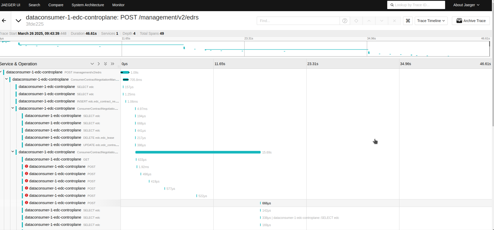
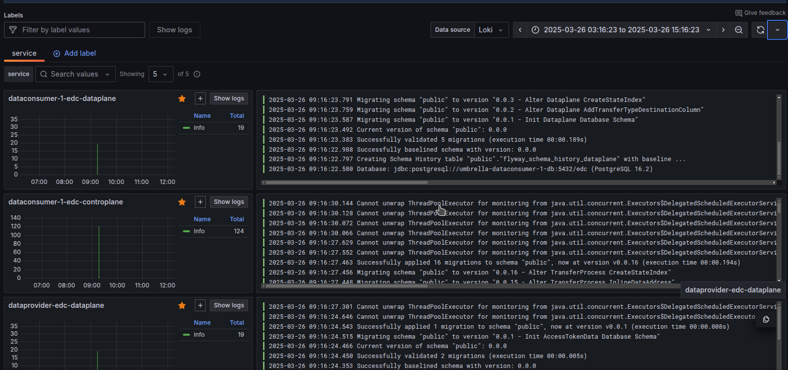
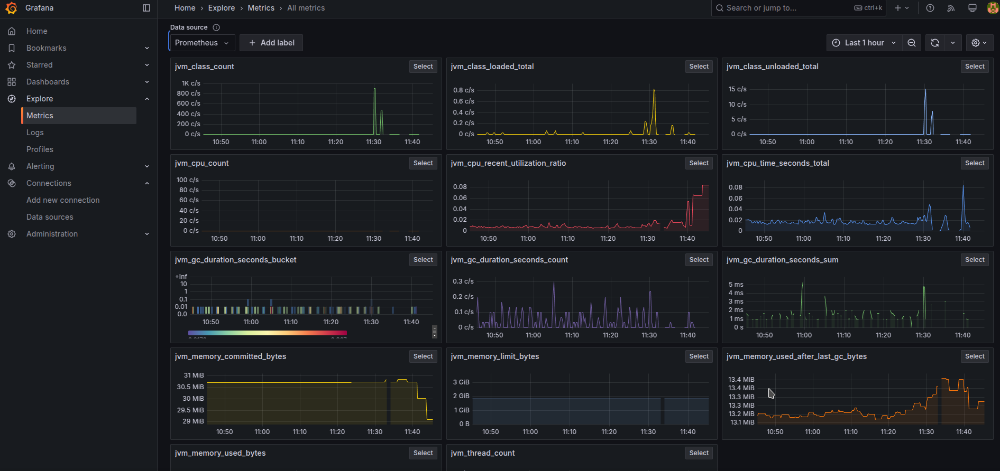
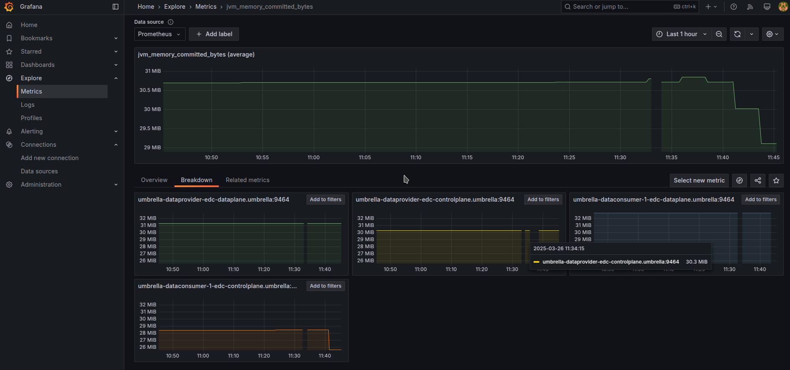

# Observability usage

This guide provides basic usage instruction of observability within umbrella deployment.

In order to deploy tractus-x-umbrella helm chart that provides data exchange between components connected with observability infrastructure run following command:

```helm
helm install -f values-adopter-data-exchange-observability.yaml umbrella . --namespace umbrella --create-namespace
```

## Jaeger (Traces)

Jaeger allows to observe traces of HTTP calls.

In order to be able to investigate traces locally we have to expose UI port (by default 16686)

```bash
kubectl get pods -n umbrella | grep "jaeger"
```

`> umbrella-jaeger-6d57ffdf74-r864j (returned pod id - will be different in each deployment)`

```bash
kubectl port-forward umbrella-jaeger-6d57ffdf74-r864j 16686:16686 -n umbrella
```



## Loki (Logs)

Loki provides functionality of aggregating logs, that can be then displayed in grafana (by default grafana takes loki as a datasource).
However in current implementation of logging mechanism, there's need for potential adjustments.

- Eclipse EDC can leverage `LoggerMonitor` by passing property during Tractus-X deployment (which relies on `java.util.logging.Logger`).
- Currently Tractus-X EDC comes with `LoggerMonitor` which uses NOPLogger implementation which doesn't communicate with OTEL out of the box - therefore there's requirement to override this Logger by including library, either `SLF4J2` or `Logback`.

In this guide Loki is configured in the way that allows otlp logs to be passed directly with OTLP protocol to the `http://umbrella-loki.umbrella:3100/otlp` endpoint.


## Prometheus (Metrics)

Prometheus aggregates metrics produced by the pods. It also scrapes metrics from data providers / data consumers in 30s interval.
In order to view Prometheus' UI use:

```bash
kubectl get pods -n umbrella | grep "prometheus-server"
```

`> umbrella-prometheus-server-7b9f94f994-ffcnt (returned pod id - will be different in each deployment)`

```bash
kubectl port-forward umbrella-prometheus-server-7b9f94f994-ffcnt 9090:9090 -n umbrella
```


## Grafana (visualization + dashboards + alerting)

Grafana allows to aggregate different datatypes from multiple datasources. In this example, we autoconfigured logs from Loki and metrics from Prometheus.

In order to grant access to Grafana's UI

```bash
kubectl get pods -n umbrella | grep "grafana"
```

`> umbrella-grafana-79ff54ff6b-zh5r9`

```bash
kubectl port-forward umbrella-grafana-79ff54ff6b-zh5r9 3000:3000 -n umbrella
```

Credentials to login by default are:

Username and password:

```text
admin
```

Credentials can be altered in Grafana's values section:

```yaml
  adminUser: admin
  adminPassword: admin
```





## NOTICE

This work is licensed under the [CC-BY-4.0](https://creativecommons.org/licenses/by/4.0/legalcode).

- SPDX-License-Identifier: CC-BY-4.0
- SPDX-FileCopyrightText: 2025 Contributors to the Eclipse Foundation
- Source URL: <https://github.com/eclipse-tractusx/tractus-x-umbrella>
