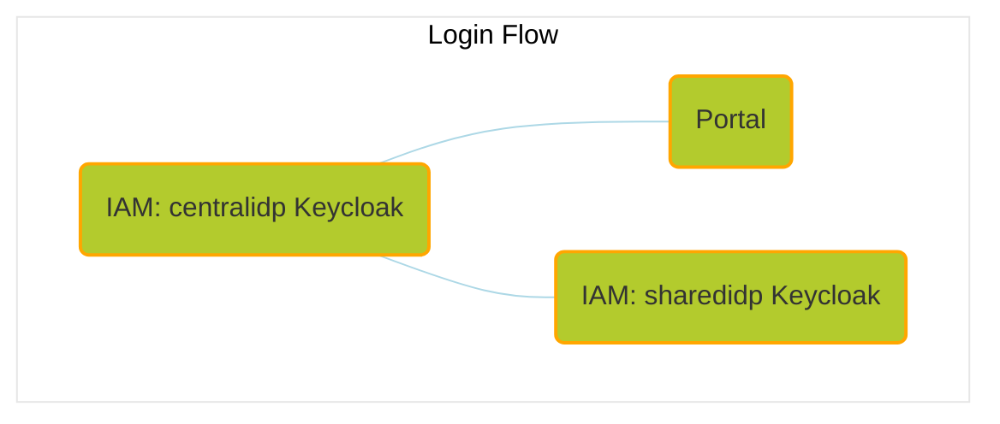

# Portal Usage

This guide provides instructions for accessing and using the Portal subset of the Umbrella Chart.

## Overview

The Portal subset is designed to manage participant onboarding and provide a user-friendly interface for interacting with the Catena-X ecosystem.



Involved components:

- Portal
- CentralIdP (Keycloak)
- SharedIdP (Keycloak)
- pgadmin4

Some components are disabled, as they are not necessary for the exclusive use of the portal. If you want to perform the onboarding of a participant, it would be necessary to enable the following components:

- BPDM
- SSI DIM Wallet Stub
- BPN-DID-Resolution-Service (BDRS)
- SSI-Credential-Issuer
- Self Description Factory
- Discovery Finder
- BPN Discovery

The relevant hosts are the following:

- <http://centralidp.tx.test/auth/>
- <http://sharedidp.tx.test/auth/>
- <http://portal-backend.tx.test>
- <http://portal.tx.test>

## Accessing the Portal

### URLs

- Portal Frontend: <http://portal.tx.test>

- Backend API Endpoints:
  - Administration: <http://portal-backend.tx.test/api/administration/swagger/index.html>
  - Registration: <http://portal-backend.tx.test/api/registration/swagger/index.html>
  - Apps: <http://portal-backend.tx.test/api/apps/swagger/index.html>
  - Services: <http://portal-backend.tx.test/api/services/swagger/index.html>
  - Notifications: <http://portal-backend.tx.test/api/notification/swagger/index.html>

### Default Credentials

Use the following credentials for the initial login as a CX-Operator:

**Username**:

```text
cx-operator@tx.test
```

**Password**:

```text
tractusx-umbr3lla!
```

> **Note**
> In case that you have TLS enabled (see [Self-signed TLS setup (Optional)](../network/tls)), make sure to accept the risk of the self-signed certificates for all the hosts before performing the first login:
>
> - <https://centralidp.tx.test/auth/>
> - <https://sharedidp.tx.test/auth/>
> - <https://portal-backend.tx.test>
> - <https://portal.tx.test>

## Keycloak Admin Console

### Admin Console Access

You can access the Keycloak admin consoles using the following URLs:

- [CentralIdP Admin Console](http://centralidp.tx.test/auth/)
- [SharedIdP Admin Console](http://sharedidp.tx.test/auth/)

### Default Credentials

Use the following credentials to log in to the admin consoles:

- **Username**:

```text
admin
```

- **Passwords**:

**CentralIdP**:

```text
adminconsolepwcentralidp
```

**SharedIdP**:

```text
adminconsolepwsharedidp
```

## Performing Participant Onboarding

The Portal allows onboarding participants by inviting them to join the network. To send invitations:

1. Log in to the Portal at `http://portal.tx.test`.
2. Navigate to the participant management section.
3. When a new request is sent to a new participant, it will be received an email which can be viewed at `http://smtp.tx.test`.

> **Note**
> Since the onboarding process requires the [Clearinghouse](https://github.com/eclipse-tractusx/portal-assets/blob/v2.1.0/docs/developer/Technical%20Documentation/Interface%20Contracts/Clearinghouse.md) to work properly, but ClearingHouse currently isn't available as a FOSS application you can skip the step with the following SQL Script which must be executed against the portal database.

> **Note**
> The Identity wallet is currently not working due to the issue in the portal backend described [here](https://github.com/eclipse-tractusx/portal/issues/499). The below sql statement supports the current workaround until the issue is resolved.

```sql
WITH applications AS (
    SELECT distinct ca.id as Id, ca.checklist_process_id as ChecklistId
    FROM portal.company_applications as ca
             JOIN portal.application_checklist as ac ON ca.id = ac.application_id
    WHERE 
      ca.application_status_id = 7 
    AND ac.application_checklist_entry_type_id = 6
    AND (ac.application_checklist_entry_status_id = 4 OR ac.application_checklist_entry_status_id = 1)
),
updated AS (
 UPDATE portal.application_checklist
     SET application_checklist_entry_status_id = 3
     WHERE application_id IN (SELECT Id FROM applications)
     RETURNING *
)
INSERT INTO portal.process_steps (id, process_step_type_id, process_step_status_id, date_created, date_last_changed, process_id, message)
SELECT gen_random_uuid(), 12, 1, now(), NULL, a.ChecklistId, NULL
FROM applications a;
```

## Testing the Setup

### Verifying Frontend Access

- Open the Portal frontend in your browser: <http://portal.tx.test>

- Log in using the default credentials provided above.

### Backend API

- Access the Swagger UI for backend APIs and test endpoints: <http://portal-backend.tx.test/api/administration/swagger/index.html>

## Notes

- Ensure DNS resolution is correctly configured for the `*.tx.test` domains.
- If TLS is enabled, access the endpoints over `https://` and accept the self-signed certificate in your browser.

For more details on Portal configuration, refer to the [Portal Subset Installation Guide](../setup/README.md#portal-subset).

## NOTICE

This work is licensed under the [CC-BY-4.0](https://creativecommons.org/licenses/by/4.0/legalcode).

- SPDX-License-Identifier: CC-BY-4.0
- SPDX-FileCopyrightText: 2024 Contributors to the Eclipse Foundation
- Source URL: <https://github.com/eclipse-tractusx/tractus-x-umbrella>
